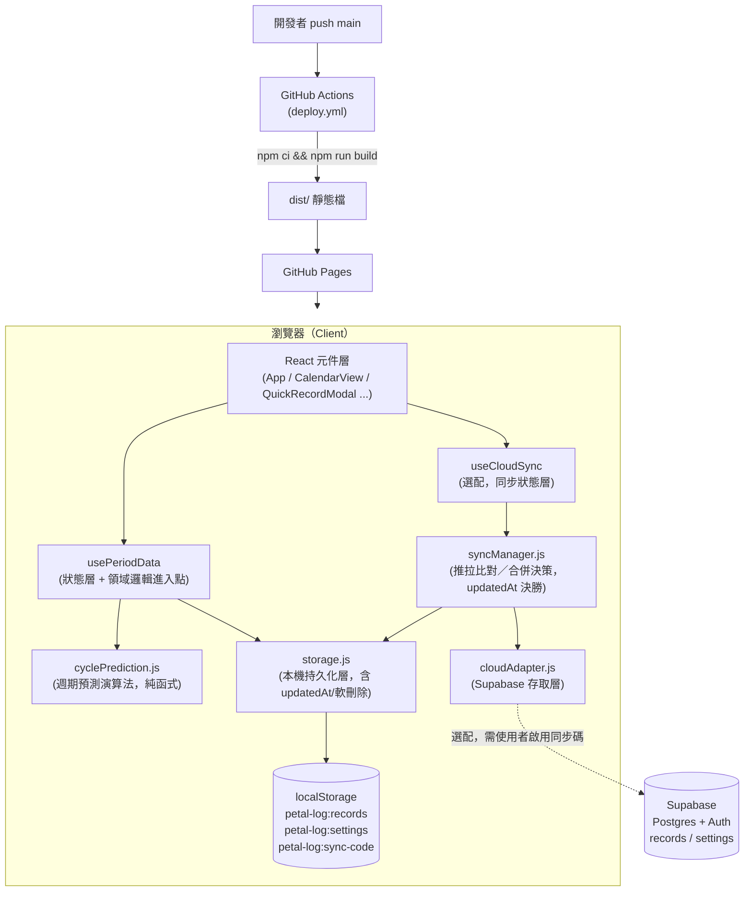
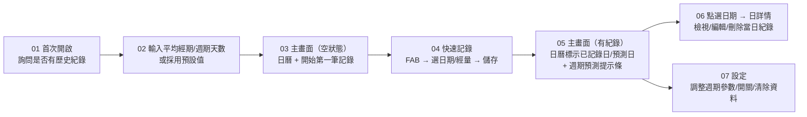

# Petal Log 軟體設計文件（Software Design Document）

| 項目 | 內容 |
|---|---|
| 專案名稱 | Petal Log |
| 文件版本 | v1.18 |
| 最後更新 | 2026-07-18 |
| 狀態 | 現行版本（對應已實作功能） |

---

## 1. 專案概述

Petal Log 是一款以隱私為優先設計的經期記錄網頁應用（Web App）。使用者可以快速記錄每日經量、在日曆上檢視歷史紀錄，並依據過去週期自動預測下一次經期的開始日與目前所在的週期天數。

**核心定位**

- **輕量、免帳號、免安裝**：開啟網頁即可使用，無需註冊。
- **資料預設留在本機**：所有紀錄預設僅存於瀏覽器 `localStorage`，不上傳任何伺服器；v1.11 起新增**選配**的雲端同步（見第 15 章），需使用者主動啟用才會有資料離開本機，不啟用者行為與過去完全相同。
- **中性化設計**：介面文案固定採用中性字眼（如「記錄」取代「經期記錄」），在他人瞥見螢幕時降低隱私暴露風險；v1.9 前曾提供可關閉的開關，但因實際影響範圍極小（僅少數按鈕文字）且中性化本來就是預設值，已簡化為固定行為，不再是使用者可調整的設定。
- **低操作成本**：從開啟 App 到完成一筆記錄，最少只需兩次點擊（FAB → 選經量 → 儲存）。

---

## 2. 目標與非目標

### 2.1 目標

1. 讓使用者在 10 秒內完成一筆經期記錄。
2. 提供「目前週期第幾天」與「預計下次日期」兩項核心預測資訊。
3. 完整支援紀錄的新增、檢視、修改、刪除（CRUD）。
4. 首次使用時透過 Onboarding 蒐集歷史週期資訊，加速預測準確度收斂。
5. 純前端為預設形態，零後端依賴，可靜態託管於 GitHub Pages；v1.11 起可選配啟用雲端同步。
6.（v1.11）在不引入傳統帳號密碼註冊流程的前提下，提供跨裝置同步與資料備份能力（見第 15 章）。

### 2.2 非目標（現階段不處理）

- 不做傳統帳號密碼註冊流程與個人資料頁（v1.11 雲端同步改採免帳號的「同步碼」機制，見第 15 章；技術上仍借用 Supabase Auth，但使用者體感上沒有註冊/登入這件事）。
- 不記錄經量以外的健康資訊（症狀、心情、體溫等）。
- 不做原生 App（iOS / Android）封裝。

---

## 3. 系統架構

Petal Log 預設是一個純前端單頁應用（SPA），沒有後端服務，所有狀態管理與資料持久化都在瀏覽器內完成。v1.11 新增一層**選配**的雲端同步（`useCloudSync` / `syncManager.js` / `cloudAdapter.js`），只有使用者主動啟用時才會介入，本機資料流完全不受影響。



**架構特點**

- **單向資料流**：UI 觸發事件 → `usePeriodData` 呼叫 `storage.js` 寫入 → 更新 React state → UI 重新渲染。元件不直接操作 `localStorage`。
- **領域邏輯與 UI 解耦**：`cyclePrediction.js` 是不依賴 React、不做 I/O 的純函式模組，方便未來單獨測試或替換演算法。
- **無全域狀態管理庫**：目前規模下用單一 Hook（`usePeriodData`）搭配 `useState`/`useMemo`/`useCallback` 已足夠，避免引入 Redux/Zustand 等額外複雜度。
- **雲端同步是附加層，不是取代層**：`syncManager.js` 透過 `storage.js` 既有的讀寫函式（含只給同步層用的 `getRecordsIncludingDeleted`/`upsertRecordsRaw`/`saveSettingsRaw`）與本機資料互動，`usePeriodData` 對外介面完全不變，只新增一個 `refreshFromStorage()` 讓背景同步寫入後能觸發重新渲染。沒有設定 Supabase 環境變數（`VITE_SUPABASE_URL`/`VITE_SUPABASE_ANON_KEY`）時，`cloudAdapter.getSupabaseClient()` 回傳 `null`，整條同步路徑優雅短路，App 其餘功能不受任何影響。

---

## 4. 技術棧

| 分類 | 選用 | 版本 |
|---|---|---|
| UI 框架 | React | ^18.3.1 |
| 建構工具 | Vite | ^5.4.11 |
| 日期處理 | date-fns | ^4.1.0 |
| 樣式方案 | CSS Modules（`*.module.css`） | — |
| 部署 | GitHub Actions + GitHub Pages | — |
| 資料儲存 | 瀏覽器 `localStorage`（預設）；Supabase（Postgres + Auth，選配同步） | — |
| 雲端同步 SDK | `@supabase/supabase-js` | ^2.110.7 |

選型原則：所有依賴都刻意精簡，符合「輕量、免安裝、快速載入」的產品定位。`@supabase/supabase-js` 是唯一因 v1.11 雲端同步功能新增的 runtime 依賴，只有設定環境變數啟用同步時才會實際發揮作用；未設定時仍會被打包進 bundle，但所有呼叫都在 `cloudAdapter.js` 內短路，不影響零依賴使用者。

---

## 5. 目錄結構

```
Pental-Log/
├── .github/workflows/deploy.yml   # CI/CD：build 後部署到 GitHub Pages
├── figma-export/                  # 設計稿匯出的靜態 HTML（UI 流程參考稿，非執行程式碼）
├── .env.example                   # 雲端同步環境變數範本（VITE_SUPABASE_URL / VITE_SUPABASE_ANON_KEY）
├── public/                        # 原樣複製進 dist/ 根目錄的靜態檔（v1.12）
│   ├── favicon.svg                # 品牌圖示（四階段色瓣造型），同時作為 PWA manifest 圖示
│   ├── manifest.webmanifest       # PWA manifest
│   └── sw.js                      # 極簡 Service Worker，唯一目的是讓 showNotification() 可用，不做離線快取
├── src/
│   ├── main.jsx                   # 進入點，額外呼叫 registerServiceWorker()
│   ├── App.jsx                    # 根元件，畫面組裝與路由狀態（onboarding / 主畫面 / 報表 / 統計），串接 usePeriodData、useCloudSync、useNotificationReminder
│   ├── assets/
│   │   └── logo.svg               # App 內標頭使用的品牌圖示（與 public/favicon.svg 同圖）
│   ├── data/
│   │   ├── storage.js             # localStorage 讀寫封裝（本機持久化層，含 updatedAt 時間戳與軟刪除 tombstone、通知提醒的裝置本地狀態）
│   │   ├── cloudAdapter.js        # Supabase 存取層：同步碼登入/註冊、records/settings 的 CRUD（camelCase↔snake_case 轉換）
│   │   └── syncManager.js         # 同步協調：推拉比對、updatedAt 決勝、換裝置加入時的合併/覆蓋決策、事件觸發
│   ├── hooks/
│   │   ├── usePeriodData.js       # 資料狀態管理 + 串接領域邏輯
│   │   ├── useCloudSync.js        # 包裝 syncManager 給 UI 用的 Hook（同步狀態、啟用/加入/合併/結束同步）
│   │   └── useNotificationReminder.js  # （v1.12）App 開啟/切回前景時檢查是否該跳提醒通知
│   ├── utils/
│   │   ├── cyclePrediction.js     # 週期預測演算法（純函式，含異常偵測）
│   │   ├── symptoms.js            # 伴隨症狀選項定義 + 症狀頻率統計
│   │   ├── syncCode.js            # 同步碼：5 個主題詞庫、產生規則、正規化與檢查碼驗證
│   │   ├── hash.js                # 純 JS SHA-256（供同步碼導出合成 email 使用，不依賴 crypto.subtle）
│   │   ├── notifications.js       # （v1.12）通知提醒領域邏輯：權限、提醒時機判斷、中性文案、顯示通知
│   │   └── registerServiceWorker.js    # （v1.12）註冊 public/sw.js，file:// 協定或不支援時安全跳過
│   ├── components/
│   │   ├── OnboardingFlow/        # 首次使用引導
│   │   ├── EmptyStateOnboarding/  # 無紀錄時的空狀態
│   │   ├── CalendarView/          # 月曆檢視
│   │   ├── PredictionBanner/      # 週期天數 / 預計下次 提示條
│   │   ├── AnomalyBanner/         # 週期異常提醒條（週期不規律／經期過長）
│   │   ├── QuickRecordModal/      # FAB 快速記錄
│   │   ├── DayDetail/             # 單日詳情（檢視/編輯/刪除）
│   │   ├── FlowPicker/            # 經量選擇（量少/中/多/未知）共用元件
│   │   ├── SymptomPicker/         # 伴隨症狀多選共用元件
│   │   ├── ReportView/            # 週期報表全畫面（摘要/歷史表/異常標記/症狀統計，可列印為 PDF）
│   │   ├── StatsView/             # （v1.12）週期圖表統計：CycleLengthChart／FlowDistributionChart（手繪 SVG）、StatsView（全螢幕頁）、StatsPreview（SettingsPanel 內嵌精簡版）
│   │   └── SettingsPanel/         # 設定面板
│   └── styles/
│       ├── tokens.css             # 設計 token（顏色/字級/間距/圓角）
│       └── global.css             # 全域樣式
└── vite.config.js                 # CI 用 base '/Petal-Log/'＋ESM；本機用相對路徑＋IIFE，讓 dist/index.html 可雙擊開啟（見第 12 章）
```

---

## 6. 模組設計

### 6.1 `App.jsx`（根元件）

- 職責：串接 `usePeriodData`，管理畫面層級的 UI 狀態（目前月份、選取日期、Modal 開關）。
- 依據 `settings.onboardingCompleted` 決定顯示 Onboarding 或主畫面。
- 依據 `records.length === 0` 決定顯示 `EmptyStateOnboarding` 或 `PredictionBanner`。

### 6.2 `usePeriodData`（狀態層）

對外提供的介面：

| 回傳值 | 說明 |
|---|---|
| `records` | 所有紀錄陣列 |
| `recordByDate` | `Map<date, record>`，供日曆快速查找 |
| `prediction` | `cyclePrediction.js` 算出的預測結果 |
| `settings` | 使用者設定 |
| `recordDay(date, flow)` | 新增或覆寫某天紀錄，內含「自動填滿後續天數」邏輯 |
| `editRecord(id, patch)` / `removeRecord(id)` | 修改 / 刪除單筆紀錄 |
| `updateSettings(patch)` | 局部更新設定並落盤 |
| `resetAllData()` | 清空所有紀錄與設定 |
| `refreshFromStorage()` | （v1.11）重新從 `storage.js` 讀取並更新 state；供 `useCloudSync` 在背景同步寫入 localStorage 後呼叫，觸發畫面重新渲染 |

**關鍵行為 — 自動填滿後續天數**：當使用者記錄「新一次經期的第一天」（前一天沒有紀錄）且 `settings.autoFillSubsequentDays` 為真時，會依平均經期天數自動建立後續數天的紀錄，減少重複操作。

### 6.3 `storage.js`（本機持久化層）

以三把 key 存取 `localStorage`：

- `petal-log:records`：紀錄陣列，寫入時依 `date` 去重並排序。
- `petal-log:settings`：使用者設定物件。
- `petal-log:sync-code`：（v1.11，選配）目前裝置啟用同步時使用的同步碼，未啟用同步則不存在。

所有讀取皆有 `try/catch` 保底，JSON 解析失敗時退回預設值，避免壞資料造成白畫面。

**v1.11 新增（供雲端同步層使用）**：`getRecords()` 對外仍只回傳未被軟刪除的紀錄，但內部改為對 `readRaw()`（含軟刪除 tombstone 列）操作；`addRecord`/`addRecords`/`updateRecord` 每次寫入都會 stamp `updatedAt`；`deleteRecord` 改為永久軟刪除（設定 `deletedAt`，資料列仍保留）。另外新增兩個只給 `syncManager.js` 使用、**不會**自動蓋上目前時間的函式：`getRecordsIncludingDeleted()`（暴露含 tombstone 的原始陣列）與 `upsertRecordsRaw(records)` / `saveSettingsRaw(settings)`（依呼叫端傳入的 `updatedAt` 原樣寫入，因為從雲端拉回的資料代表「雲端在某個時間點的狀態」，不該被蓋上本機現在時間，否則會讓下一輪同步誤判新舊）。詳見第 15 章。

### 6.4 `cyclePrediction.js`（領域邏輯層）

詳見第 8 章。

### 6.5 雲端同步相關模組（v1.11，選配）

| 模組 | 職責 |
|---|---|
| `cloudAdapter.js` | 唯一直接呼叫 `@supabase/supabase-js` 的模組。`getSupabaseClient()` 在環境變數缺少時回傳 `null`，其餘函式一律先檢查這個並短路。提供 `signUpWithCode`/`signInWithCode`（由同步碼導出合成 email + 密碼，借用 Supabase 內建 email/password 登入），以及鏡射 `storage.js` 介面的 `getRecords`/`addRecord`/`addRecords`/`updateRecord`/`deleteRecord`/`getSettings`/`saveSettings`（camelCase↔snake_case 轉換），還有清除雲端資料用的 `deleteAllCloudData` |
| `syncManager.js` | 同步協調中樞：`enableSyncNew()` 產生新碼並推送本機資料；`enableSyncJoin(code)` 驗證格式/檢查碼後登入，本機已有資料時回傳 `needsDecision` 交由 UI 詢問；`resolveJoin(strategy)` 依 `'merge'`/`'overwrite-with-cloud'` 完成加入；`runSync()` 逐筆用 `updatedAt` 決勝合併 records 與 settings；`resetEverything()` 供「清除所有紀錄」在同步啟用時連同雲端一起清空。以 `subscribe(callback)` 提供簡易 pub-sub，同步完成時通知訂閱者。在 `online` 事件、分頁回到前景（`visibilitychange`）與 App 啟動時（若已啟用同步）觸發，不使用輪詢 |
| `useCloudSync.js` | 包裝 `syncManager.js` 給 React 用的 Hook，暴露 `{ status, enableSyncNew, enableSyncJoin, resolveJoin, revealCode, disableSync, resetEverything }`；接受一個 `onSynced` callback（`App.jsx` 傳入 `usePeriodData` 的 `refreshFromStorage`），背景同步完成時自動觸發畫面更新 |
| `syncCode.js` | 定義 5 個彼此不重疊的主題詞庫（Cosmos／Reverie／Fortress／Tide／Wildwood，各 10 個形容詞/名詞/副詞/動詞），`generateSyncCode()` 隨機組出「主題詞-主題詞-4碼隨機英數-1碼檢查碼」格式的碼，`validateSyncCodeChecksum()` 在呼叫 Supabase 前先做格式與檢查碼驗證 |
| `hash.js` | 純 JS SHA-256 實作，供 `cloudAdapter.deriveEmailFromCode` 把同步碼轉成穩定的合成 email；刻意不用 `crypto.subtle`，因為本機建置版以 `file://` 開啟時該 API 是否可用不穩定 |

詳見第 15 章「雲端同步設計」。

### 6.6 通知提醒相關模組（v1.12，選配）

專案沒有推播伺服器，這是「前景檢查」機制：只在 App 被開啟或切回前景時檢查是否該提醒，App 完全沒開啟時不會跳通知，見 14.1。

| 模組 | 職責 |
|---|---|
| `notifications.js` | 純函式為主，不依賴 React。`isNotificationSupported`/`getPermission`/`requestPermission` 包裝瀏覽器 `Notification` API；`isReminderDue(prediction, settings, notificationState)` 判斷「今天」是否落在 `[nextPredictedDate - reminderDaysBefore, nextPredictedDate]` 區間內且這個預計日期還沒提醒過；`buildReminderContent` 產生固定中性文案（沿用第 2 章原則，不出現「經期」「生理期」等字眼）；`showReminderNotification` 優先透過 `navigator.serviceWorker.ready` 呼叫 `registration.showNotification()`，不可用時退回 `new Notification()` |
| `useNotificationReminder.js` | 接受 `(prediction, settings)`，在 mount 與分頁回到前景（`visibilitychange`）時執行檢查，比照 `syncManager.js` 用事件觸發、不用輪詢的既有慣例；符合條件就顯示通知並把 `nextPredictedDate` 記進 `storage.saveNotificationState`，避免同一天重複提醒 |
| `registerServiceWorker.js` | 註冊 `public/sw.js`。`'serviceWorker' in navigator` 為假或協定是 `file:`（本機雙擊開啟 `dist/index.html`）時直接短路跳過，呼應 `cloudAdapter.getSupabaseClient()` 的短路風格；`main.jsx` 呼叫一次 |
| `public/sw.js` | 極簡 Service Worker：`install`/`activate` 只做基本生命週期處理（`skipWaiting`/`clients.claim`），`notificationclick` 讓點擊通知時聚焦既有視窗或開新視窗。刻意不做離線快取——Vite 輸出的 hashed 檔名若要做離線快取需要額外處理版本失效，超出目前範圍 |

### 6.7 UI 元件

| 元件 | 職責 |
|---|---|
| `OnboardingFlow` | 二階段引導：詢問是否有歷史紀錄 → 輸入平均經期/週期天數，或直接採用預設值（5 天 / 28 天） |
| `EmptyStateOnboarding` | 無任何紀錄時的第一次記錄呼籲（CTA） |
| `CalendarView` | 月曆格線渲染、月份切換、標示「已記錄日」「預測日」「易孕期」「排卵日」與（選配）四階段色條、點擊進入日詳情 |
| `PredictionBanner` | 顯示「本次週期第幾天／距離下次」「預計下次日期」「易孕期區間」（含免責提示） |
| `AnomalyBanner` | 當 `prediction.hasAnomalies` 為真且 `settings.showAnomalyAlerts` 開啟時顯示，列出偵測到的異常次數，並提供「查看報表」按鈕開啟 `ReportView` |
| `QuickRecordModal` | 由主畫面 FAB 觸發，快速記錄「今天或指定日期」的經量（不含症狀，維持最少點擊）；經量預設選取「未知」（v1.16），不主動假設使用者沒特別選就是「量中」 |
| `DayDetail` | 點選日曆某天後的詳情面板，可新增/編輯/刪除當天紀錄，顯示「經期第幾天」或「排卵日/易孕期」標註，並可選配顯示伴隨症狀記錄區塊；新增紀錄時經量預設選取「未知」（v1.16），編輯既有紀錄則沿用該筆紀錄原本的經量 |
| `FlowPicker` | 「量少 / 量中 / 量多 / 未知」四選一元件，供 `QuickRecordModal` 與 `DayDetail` 共用；「未知」代表當天有出血但不確定/不記得經量，與「不建立當天紀錄」是兩回事（v1.13） |
| `SymptomPicker` | 伴隨症狀多選晶片元件，選項來源為 `src/utils/symptoms.js` 的內建症狀（已排除 `settings.hiddenSymptoms` 中的項目）再併入 `settings.customSymptoms`；晶片顏色讀 `settings.symptomColors`（覆寫）或選項的 `defaultColor`；另有「其他」晶片，開啟後顯示自由文字輸入框，寫入 `Record.symptomNote`。供 `DayDetail` 使用 |
| `ReportView` | 取代主畫面的全畫面報表頁：時間區間選擇列（近 3 個月／近 6 個月／全部／自訂區間，預設「全部」，v1.17）、摘要統計、異常提醒、週期歷史表（依選定區間篩選，起始日**倒敘**排列，越接近現在排越上面，v1.17）、伴隨症狀頻率統計，提供「列印／另存為 PDF」按鈕（呼叫瀏覽器原生 `window.print()`，零依賴） |
| `StatsView`（v1.12） | 取代主畫面的全畫面統計頁：「近 6 個月週期天數趨勢」（`CycleLengthChart`，長條圖，異常週期換狀態色＋⚠圖示，附平均線，每根長條直接標示天數）與「經量分佈」（`FlowDistributionChart`，量少/中/多三階單色相橫條 + 中性灰「未知」分段，ordinal 色階，色塊夠寬時直接標示百分比）。資料直接複用 `prediction.cycleHistory`（已經是 `groupIntoCycles` 的分組結果）與 `records`，篩選近 6 個月，不重複造輪子。兩張圖表皆手繪 SVG，零額外圖表庫依賴；兩個區塊各自可摺疊（標題列即為切換按鈕，預設展開），見 v1.13 |
| `StatsPreview`（v1.12） | `SettingsPanel` 內嵌的精簡預覽版，直接複用 `CycleLengthChart`／`FlowDistributionChart` 的 `compact` 模式（省略座標軸/⚠標籤，但保留圖例文字說明與長條上的天數數值，見 v1.14、v1.15），下方「查看完整統計」按鈕開啟 `StatsView`；`SettingsPanel` 內以「週期圖表統計」手風琴包住整塊預覽，預設收起，見 v1.13 |
| `SettingsPanel` | 調整平均經期/週期天數、自動填滿開關、排卵預測顯示開關、週期階段顏色提示（手風琴，展開後為四階段開關＋色票）、症狀記錄開關（手風琴，展開後為「症狀項目與顏色設定」：內建症狀的顯示/隱藏開關＋色票、自訂症狀新增/刪除）、異常提醒開關、查看報表入口、「週期圖表統計」手風琴（v1.12，預設收起，展開後為 `StatsPreview` 統計預覽與完整統計入口）、通知提醒開關與提前天數設定（v1.12，見 6.6）、清除所有資料；（v1.11，僅在 `cloudSync.status.configured` 為真時顯示）「雲端同步」手風琴：未啟用時可選擇同步碼主題風格並「建立新同步碼」，或「輸入已有的同步碼」加入；已啟用時同步碼預設遮蔽、僅提供「複製」按鈕（v1.12 移除了顯示/隱藏切換與綁定救援 email，見 15.6 已知限制）、結束同步 |

---

## 7. 資料模型

### 7.1 Record（單日紀錄）

```ts
{
  id: string          // 產生規則：`${date}-${Date.now()}` 或含 index 後綴
  date: string         // 'yyyy-MM-dd'
  flow: 'light' | 'medium' | 'heavy' | 'unknown'  // 'unknown'（v1.13）：當天有出血但不確定/不記得經量；`estimateSubsequentFlow` 遇到 'unknown' 會直接把後續估算天數也回傳 'unknown'（無法從「不知道」推算遞減趨勢），不特別當作例外處理
  symptoms: string[]   // 伴隨症狀代碼陣列（內建代碼見 `src/utils/symptoms.js`，或自訂症狀的 `custom-<timestamp>` id）；預設 []，自動填滿產生的後續天數不帶入首日症狀
  symptomNote: string  // 「其他」欄位使用者自行輸入的自由文字；預設 ''，同樣只有首日會帶入
  updatedAt: string    // （v1.11）ISO 時間戳，每次 add/update/delete 都會重新蓋章；未啟用雲端同步也會寫入，供將來啟用時直接使用，無需遷移
  deletedAt: string | null  // （v1.11）軟刪除時間戳；`storage.getRecords()` 會過濾掉 deletedAt 不為 null 的列，只有同步層透過 `getRecordsIncludingDeleted()` 才看得到
}
```

### 7.2 Settings（使用者設定）

```ts
{
  avgPeriodLength: number           // 平均經期天數（預設 5）
  avgCycleLength: number            // 平均週期天數（預設 28）
  autoFillSubsequentDays: boolean   // 記錄首日時是否自動填滿後續天數（預設 true）
  onboardingCompleted: boolean      // 是否已完成引導（預設 false）
  showOvulationPrediction: boolean  // 是否顯示排卵日/易孕期預測（預設 true）
  showMenstrualPhase: boolean       // 月曆是否標示月經期顏色（預設 false）
  showFollicularPhase: boolean      // 月曆是否標示濾泡期顏色（預設 false）
  showOvulationPhase: boolean       // 月曆是否標示排卵期顏色（預設 false）
  showLutealPhase: boolean          // 月曆是否標示黃體期顏色（預設 false）
  showSymptomTracking: boolean      // `DayDetail` 是否顯示伴隨症狀記錄區塊（預設 false）
  showAnomalyAlerts: boolean        // 是否在主畫面顯示 `AnomalyBanner`（預設 true）
  phaseColors: {                    // 四階段各自的顏色（hex），可在設定中用色票調整
    menstrual: string                 // 預設 '#b5645c'
    follicular: string                // 預設 '#c98a2b'
    ovulation: string                 // 預設 '#4f9d8c'
    luteal: string                    // 預設 '#6f8fb0'
  }
  customSymptoms: { id: string, label: string }[]  // 使用者自訂的症狀項目，預設 []，id 格式為 `custom-${Date.now()}`
  symptomColors: Record<string, string>            // 症狀代碼（含內建與自訂）→ hex 顏色的覆寫表，未設定的內建症狀退回 `SYMPTOM_OPTIONS` 的 `defaultColor`
  hiddenSymptoms: string[]          // 被隱藏、不在 `SymptomPicker` 顯示的內建症狀代碼，預設 []（全部顯示）；僅適用內建症狀，自訂症狀直接刪除即可
  notificationsEnabled: boolean     // （v1.12）是否開啟提醒通知（預設 false，opt-in）
  reminderDaysBefore: number        // （v1.12）預計經期前幾天提醒（預設 2）
  updatedAt: string | null          // （v1.11）ISO 時間戳，`saveSettings` 每次寫入都會重新蓋章；預設 null（從未存過）
}
```

> `storage.js` 的 `getSettings()` 讀取時會與 `DEFAULT_SETTINGS` 合併，確保舊版本存下、缺少新欄位的 settings 物件在升級後仍能取得新欄位的預設值。

### 7.3 儲存 Key

| Key | 內容 |
|---|---|
| `petal-log:records` | `Record[]`，依日期排序（含軟刪除 tombstone 列） |
| `petal-log:settings` | `Settings` |
| `petal-log:sync-code` | （v1.11，選配）字串，目前裝置啟用同步時使用的同步碼；未啟用則不存在此 key |
| `petal-log:notification-state` | （v1.12）`{ notifiedForDate: string \| null }`，裝置本地狀態，記錄「這個預計日期已經提醒過」避免同一天重複跳通知。刻意不放進 `Settings`，因為會被雲端同步的 `updatedAt` 決勝機制同步到其他裝置，但這是裝置本地才有意義的狀態 |

> 目前沒有 schema 版本欄位；若未來調整資料結構，需在 `storage.js` 加入遷移（migration）邏輯，見第 13 章。

---

## 8. 核心演算法：週期預測

程式碼位置：`src/utils/cyclePrediction.js`

### 8.1 名詞定義

- **經期天數**：一次連續出血持續的天數。
- **週期天數**：從「這次經期第一天」到「下次經期第一天」的間隔天數。

### 8.2 演算流程

1. **`groupIntoCycles`**：將所有已排序的紀錄日期，依「相鄰日期間隔 ≤ 1 天視為同一次經期」的規則分組成多個「週期（cycle）」，每組記錄起始日、結束日、長度。
2. **`averageCycleLength`**：若歷史週期數 ≥ 2，取**最接近現在的最多 `MAX_CYCLES_FOR_AVERAGE`（6）次**週期起始日間隔的平均值；否則採用使用者設定值 `avgCycleLength`。超過 6 次的較舊紀錄不再納入計算，讓平均值更貼近近期實際狀況。
3. **`averagePeriodLength`**：取「非最新一次」歷史週期中，**最接近現在的最多 6 次**長度平均值（最新一次可能尚未結束，故排除，避免低估）；資料不足時採用設定值 `avgPeriodLength`。
4. **`nextPredictedDate`**：最近一次週期起始日 + 平均週期天數。
5. **`currentCycleDay`**：找出「今天以前（含今天）已開始」的最後一個週期，計算今天是該週期第幾天。此設計刻意排除未來日期的週期，避免使用者手動輸入未來紀錄時，「今天」找不到對應週期而顯示消失。
6. **`isPeriodActive`**：判斷「今天」是否落在最近一次連續紀錄範圍（`referenceCycle.startDate` ~ `referenceCycle.lastDate`）內，代表生理期是否仍在進行。
7. **`daysUntilNextPeriod`**：`nextPredictedDate` 與今天的天數差，可能為負值（代表已超過預計天數，週期延遲）。`PredictionBanner` 依 `isPeriodActive` 決定首個卡片顯示「本次週期第幾天」（進行中）或「距離下次還有幾天」（已結束），避免生理期結束後仍顯示令人困惑的週期天數。
8. **`predictedDates`**：以 `nextPredictedDate` 為起點，往後推 `averagePeriodLength` 天，標記為日曆上的「預測日」；若使用者關閉自動填滿且目前正處於一次經期中，會額外補上「本次週期尚未記錄但理論上應落在經期內」的天數，讓預測與實際填寫方式保持一致。

### 8.3 邊界情況

- 無任何紀錄：回傳 `hasData: false`，UI 顯示 `EmptyStateOnboarding`，不顯示 `PredictionBanner`。
- 只有一次週期紀錄：`averageCycleLength`／`averagePeriodLength` 退回使用者設定值。
- 演算法目前**不排除異常值**（例如使用者手誤造成的極端週期天數會直接拉進平均值）——已知限制，見第 13 章。

### 8.4 排卵與易孕期預測

`getCyclePrediction` 在算出 `nextPredictedDate` 後，會額外呼叫內部函式 `getFertilityPrediction(nextPredictedDate)`，以「日曆推算法」的通用假設回推：

- **排卵日（`ovulationDate`）**：假設黃體期固定為 14 天，即 `nextPredictedDate - 14 天`。
- **易孕期（`fertileWindowStart` ~ `fertileWindowEnd`）**：涵蓋精子存活時間（排卵前 5 天）與卵子存活時間（排卵後 1 天），即 `[排卵日 - 5, 排卵日 + 1]`。
- `fertileWindowDates`：易孕期區間內每一天的日期字串陣列，供 `CalendarView` 標記使用。

**已知限制**：此為標準日曆推算估計值，**非醫療診斷**，週期不規律的使用者準確度會明顯下降；短週期（如 `avgCycleLength` 接近 15 天下限）時，回推的易孕期可能與經期日重疊。UI 於 `PredictionBanner` 固定顯示免責提示文字。`showOvulationPrediction` 設定為 `false` 時，`App.jsx` 不會把 `fertileWindowDates`／`ovulationDate` 傳入 `CalendarView`／`PredictionBanner`／`DayDetail`，達成選配（opt-in／opt-out）效果。

### 8.5 週期四階段（月經期／濾泡期／排卵期／黃體期）

`getCyclePhases(cycleStartDate, averagePeriodLength, ovulationDate, nextPredictedDate)` 將**最近一次週期起始日**到**下次預計週期起始日前一天**（正好一個完整 `averageCycleLength`）依生理定義切成四段：

| 階段 | 區間 | 預設顏色（`settings.phaseColors`） |
|---|---|---|
| 月經期 `menstrualPhaseDates` | `cycleStartDate` ~ `cycleStartDate + averagePeriodLength - 1` | `menstrual` = `#b5645c` |
| 濾泡期 `follicularPhaseDates` | 月經期結束隔天 ~ 排卵日前一天 | `follicular` = `#c98a2b` |
| 排卵期 `ovulationPhaseDates` | 僅 `ovulationDate` 當天 | `ovulation` = `#4f9d8c` |
| 黃體期 `lutealPhaseDates` | 排卵日隔天 ~ 下次預計週期前一天 | `luteal` = `#6f8fb0` |

任一區間若起訖日反轉（如經期天數過長導致濾泡期被壓縮為 0 天）則回傳空陣列，`getDateRange` 內建此保護。四個階段各自對應一個 `Settings` 開關（`showMenstrualPhase` 等），預設皆為 `false`（opt-in）；`App.jsx` 只在對應開關開啟時才把日期陣列傳給 `CalendarView`，首頁 `PredictionBanner` 不顯示這四個階段的文字說明，僅在月曆日格上方以一條 3px 色條標示（`CalendarView.module.css` 的 `.phaseIndicator`，用 inline `style` 套用 `settings.phaseColors` 而非固定 CSS class），與底部既有的易孕期／排卵日圓點（見 8.4）分開，避免視覺重疊。每個階段的顏色可在 `SettingsPanel` 用 `<input type="color">` 個別調整，寫回 `settings.phaseColors[phase]`。

### 8.6 異常偵測與週期報表

`analyzeCycleHistory(cycles, averageCycleLength, hasReliableAverage, today)` 逐一檢視 `groupIntoCycles` 分出的每一次週期，標記兩種異常（僅為日曆推算的粗略提示，**非醫療診斷**）：

| 異常類型 | 判斷條件 |
|---|---|
| 經期過長 `isProlongedPeriod` | 該次週期的連續紀錄天數（`cycle.length`）超過 `PROLONGED_PERIOD_DAYS`（8 天） |
| 週期不規律 `isIrregularCycle` | 該次週期到下次週期的間隔天數（`cycleLength`）小於 `NORMAL_CYCLE_MIN_DAYS`（21）、大於 `NORMAL_CYCLE_MAX_DAYS`（45，v1.16 由 35 調整為 45——臨床上常見的「正常週期」定義是 21～35 天，這裡刻意放寬絕對上限，35～45 天之間但明顯偏離個人平均的情況交給下面的個人化門檻去抓，避免只因為比教科書定義寬一點，就把使用者自己一貫如此的週期標成異常），**或**（在 `hasReliableAverage` 為真，即至少有 2 次週期間隔可計算平均時）與 `averageCycleLength` 相差超過 `PERSONAL_CYCLE_DEVIATION_DAYS`（7 天）。最新一次週期因尚未有下一次起始日，`cycleLength` 為 `null`，不做此項判斷 |

`getCyclePrediction` 回傳的 `cycleHistory` 陣列即為逐週期的 `{ startDate, endDate, periodLength, cycleLength, isProlongedPeriod, isIrregularCycle, isRecent }`；`isRecent`（v1.16）代表該次週期起始日落在近 `ANOMALY_ALERT_WINDOW_MONTHS`（6 個月）內。`hasAnomalies`／`prolongedPeriodCount`／`irregularCycleCount` 這三個彙總值（v1.16 起）**只計入 `isRecent` 為真的週期**，超過半年前的異常不會再被算進去；`cycleHistory` 陣列本身則不受此限制，每一筆歷史紀錄的 `isProlongedPeriod`／`isIrregularCycle` 仍如實標記，供 `ReportView` 的週期歷史表完整呈現。這個設計讓「提醒」只反映近期實際需要留意的狀況，「歷史記錄」則保留完整、不失真。

- **`AnomalyBanner`**：`settings.showAnomalyAlerts`（預設 `true`）開啟且 `prediction.hasAnomalies` 為真（即近 6 個月內有異常）時，於主畫面 `PredictionBanner` 下方顯示提醒文字與「查看報表」按鈕。
- **`ReportView`**：由 `SettingsPanel`「查看週期報表」或 `AnomalyBanner`「查看報表」開啟，於 `App.jsx` 以 `isReportOpen` 狀態整頁取代主畫面（同 Onboarding 的整頁切換模式），內容包含：
  1. **時間區間選擇列**（v1.17，`.noPrint`，不會出現在列印/PDF 結果裡，但選定的區間會反映在下面印出的內容中）：「近 3 個月」／「近 6 個月」／「全部」／「自訂區間」四顆按鈕，預設「全部」；選「自訂區間」時顯示起訖日期的 `<input type="date">`。此區間會篩選 2、3、4 點的資料範圍（`cycleHistory` 依 `startDate`、`records` 依 `date` 落在 `[rangeStart, rangeEnd]` 內），但**不**影響「平均週期／經期天數」（`averageCycleLength`／`averagePeriodLength` 沿用 `prediction` 既有、固定取最近 6 次週期的演算法結果，見 8.2）與「異常提醒」的次數（固定只看近 6 個月，見下）——這兩者是跟這次報表無關、App 本身既有的系統性數字，不隨報表的顯示區間改變。
  2. 摘要統計：已記錄週期數、平均週期／經期天數、週期／經期天數範圍（後三者取自篩選後 `cycleHistory` 逐項最小最大值）。
  3. 異常提醒（`hasAnomalies` 時顯示，僅計入近 6 個月內的異常，見 8.6，不受第 1 點的報表顯示區間影響）：異常次數與門檻說明。
  4. 週期歷史表：逐次週期的起始日、結束日、經期天數、週期天數，依選定區間篩選後**依起始日倒敘排列**（v1.17，越接近現在排越上面，方便查看近況；`cycleHistory`／`usePeriodData` 等底層資料仍維持既有的正序假設，只在這裡顯示時反轉，不影響其他邏輯），異常列以底色與 `⚠` 標示；區間內沒有紀錄時顯示提示文字而非空表格。
  5. 伴隨症狀統計：`summarizeSymptoms(records, settings.customSymptoms)`（定義於 `src/utils/symptoms.js`）統計選定區間內每個症狀代碼（含自訂）出現次數，並列出所有「其他」自由文字備註（依日期排序）；v1.17 起改吃篩選後的 `records`，與上面的區間選擇保持一致。
  6. 「列印／另存為 PDF」按鈕呼叫瀏覽器原生 `window.print()`；`ReportView.module.css` 用 `@media print` 隱藏返回／列印按鈕列與時間區間選擇列（`.noPrint`），不需要任何 PDF 產生套件，維持專案「零額外重依賴」原則。
  7. **列印防溢出**：`.table` 使用 `table-layout: fixed`，並在表格儲存格、統計清單、備註清單上加 `overflow-wrap: break-word` / `word-break: break-word`。原因：症狀備註是使用者自由輸入的文字，可能出現沒有空白可斷行的長字串（例如英數字混雜），若表格維持預設的 `table-layout: auto`，瀏覽器會依內容最小寬度撐開欄位，導致整張表格比列印頁面還寬而被裁切、且列印對話框的「縮放比例」對此無效（縮放是在版面配置完成後才套用，無法讓已經超寬的表格重新換行）。同時在 `@media print` 加上 `@page { margin: 12mm }` 與較小的表格字級，讓內容穩定落在紙張可印刷範圍內。
  8. **列印安全邊距**：`@page { margin: 12mm }` 並非所有瀏覽器／印表機驅動、或「列印為 PDF」的轉檔路徑都會確實套用（例如部分環境會忽略 `@page` 規則），若只靠它留白，內容可能貼齊紙張最外緣，實際列印時被裁切。因此 `.page` 在 `@media print` 下額外保留 `padding: 8mm`，把安全邊距內建在內容本身的版面配置裡，不依賴 `@page` 是否生效，雙重保險。

---

## 9. 使用者流程

對應 `figma-export/` 內的設計稿順序：



**主要互動路徑**

- **首次使用**：`01 → 02（或跳過）→ 03`。
- **日常記錄**：主畫面點 FAB →（`04`）選日期與經量 → 儲存 → 日曆即時更新。
- **補記錄/修改/刪除**：主畫面點日曆格子 →（`06`）進入 `DayDetail`。
- **調整參數**：主畫面右上角齒輪 →（`07`）`SettingsPanel`。

---

## 10. 設計系統（UI 視覺語言）

定義於 `src/styles/tokens.css`，供作品集展示參考：

- **主色 Rose**（`#b5645c` 系）：代表「已記錄的經期日」，也是四階段色條「月經期」的預設色。
- **輔色 Lavender**（`#9b8ac4` 系）：代表「預測日」，也是 `SymptomPicker`「其他」晶片與自訂症狀的預設色。
- **點綴色 Mint**（`#4f9d8c` 系）：代表「易孕期／排卵日」，也是四階段色條「排卵期」的預設色，與 Rose/Lavender 區隔以降低誤讀風險。
- **階段色 Amber**（`#c98a2b` 系）／**Slate**（`#6f8fb0` 系）：分別是四階段色條「濾泡期」與「黃體期」的預設色，僅在 `SettingsPanel` 個別開啟對應開關時才會出現在月曆上。
- **症狀色**：`src/utils/symptoms.js` 為 10 個內建症狀各指定一個 `defaultColor`（延伸自上述色系的低飽和變體）；四階段與所有症狀（含自訂）的顏色都**不是寫死的 token**，而是存在 `settings.phaseColors`／`settings.symptomColors`，可在 `SettingsPanel` 用原生 `<input type="color">` 色票逐一調整，`CalendarView`／`SymptomPicker` 皆以 inline `style` 套用實際值，token 只作為兩者的預設值來源。
- **中性色**：米白底（`#fbf6f3`）+ 深棕字（`#453936`），營造柔和、低刺激的視覺氛圍，符合健康記錄類產品的情緒基調。
- **字型**：中文用 Noto Sans TC / PingFang TC；數字（日期）用 Inter，強化日曆數字的辨識度。
- **圓角與陰影**：卡片/面板使用 `16px` 圓角與柔和陰影，Modal 皆以 bottom-sheet 形式呈現，符合行動裝置操作習慣。

---

## 11. 非功能需求

### 11.1 隱私與資料安全

- **零伺服器、零帳號（預設）**：未啟用雲端同步時，所有資料只存在使用者自己的瀏覽器內，不會有第三方（含開發者本人）能存取。
- **雲端同步是明確 opt-in 的例外（v1.11）**：使用者主動啟用後，資料會存到開發者自建的 Supabase 專案（Postgres，以 Row Level Security 限制每個帳號只能存取自己的資料）。這是刻意的取捨：換取跨裝置同步／備份能力，代價是 Supabase 服務方在技術上具備存取未加密資料的能力（標準 BaaS 安全水準，非端對端加密）。詳見第 15.6 節。
- **中性語言（固定行為）**：介面文案固定使用中性字眼（如「記錄」），降低他人瞥見螢幕時識別出這是經期記錄 App 的風險；不再提供關閉此行為的設定。
- **風險**：`localStorage` 未加密，共用裝置上的其他使用者理論上可透過瀏覽器開發者工具讀取；目前不在威脅模型（threat model）處理範圍內。啟用同步後，同步碼本身以明碼存在本機 `localStorage`，與此風險模型一致（見第 15.6 節）。

### 11.2 效能

- 未啟用雲端同步時 runtime 依賴僅 3 個套件；`@supabase/supabase-js`（v1.11 新增）即使未設定環境變數也會被打包進 bundle，但不會被執行，對載入效能的影響僅止於 bundle 體積（見第 4 章）。
- 所有清單/日曆運算使用 `useMemo` 快取，避免不必要的重算。

### 11.3 無障礙（Accessibility）

- 已具備：`aria-label`（月份切換、設定按鈕）、`role="dialog"` + `aria-modal`（各 Modal）、`role="radiogroup"` + `aria-checked`（`FlowPicker`）。
- 尚待加強：鍵盤 focus trap（Modal 開啟時焦點未強制鎖定於面板內）、色彩對比的正式驗證（WCAG AA）。

### 11.4 瀏覽器相容性

- 依賴 `localStorage`、`<input type="date">`，需現代瀏覽器（不含 IE）。
- 目前未做 `localStorage` 不可用（無痕模式限制、容量滿）時的錯誤提示與降級處理。

---

## 12. 部署與 CI/CD

- **流程**：push 到 `main` 分支 → GitHub Actions（`.github/workflows/deploy.yml`）執行 `npm ci && npm run build` → 產出的 `dist/` 上傳為 Pages artifact → 部署到 GitHub Pages。
- **無測試關卡**：目前 CI 只做 build，沒有 lint / 單元測試步驟（見第 13 章已知限制）。
- **雙重建置模式**：`vite.config.js` 以 GitHub Actions 自動設定的 `CI` 環境變數區分兩種建置結果：
  - **CI（`CI=true`，GitHub Pages）**：`base: '/Petal-Log/'`（對應 repo 子路徑），輸出標準 ES module（`<script type="module">`），走 http(s) 協定不受檔案協定限制。
  - **本機（未設定 `CI`）**：`base: './'`（相對路徑）；`build.rollupOptions.output.format` 改為 `'iife'`，打成單一傳統 script；自訂的 `localFileOpenHtml` 外掛（`transformIndexHtml`）把輸出 HTML 的 `type="module"` 換成 `defer`、移除 `crossorigin` 屬性。這是因為用瀏覽器直接以 `file://` 開啟 `dist/index.html` 時，Chrome 會以「origin 是 null」擋掉 `type="module"` 與帶 `crossorigin` 資源的 CORS 請求，導致空白頁；改成傳統 `<script defer>` 就能繞開此限制，讓 `npm run build` 產出的 `dist/index.html` 可以直接雙擊在瀏覽器開啟，不需要跑任何伺服器或指令。兩種模式產出的功能完全一致，只有打包格式與路徑不同。`@supabase/supabase-js`（v1.11）已驗證可正常打進本機 IIFE 模式，不需要 `inlineDynamicImports` 之類的例外處理。
- **雲端同步環境變數（v1.11，選配）**：`vite build` 讀取 `VITE_SUPABASE_URL`／`VITE_SUPABASE_ANON_KEY`。本機開發用專案根目錄的 `.env`（已加入 `.gitignore`，不會被提交，`.env.example` 提供範本）；GitHub Actions 部署版則需要在 repo 的 **Settings → Secrets and variables → Actions** 額外新增這兩個 secret，`deploy.yml` 的 build step 才會把它們帶入建置。未設定這兩個變數時，`cloudAdapter.getSupabaseClient()` 回傳 `null`，App 其餘功能不受影響，雲端同步區塊也不會顯示在設定畫面。anon key 設計上就是給前端公開使用的，安全性由 Supabase 的 Row Level Security 保護，不需要當作機密處理。

---

## 13. 已知限制

| 限制 | 說明 |
|---|---|
| 單裝置、無備份（預設） | 未啟用 v1.11 雲端同步時，資料僅存於單一瀏覽器的 `localStorage`；清除瀏覽器資料、換裝置、換瀏覽器即遺失紀錄，且無任何匯出/備份手段。 |
| 雲端同步的熵取捨 | 同步碼安全性以 4 碼隨機英數為主要下限（約 30 bits），是為了碼好抄好記的刻意取捨，靠 Supabase 端登入失敗鎖定機制補強，非銀行等級安全性，詳見 15.2、15.6。 |
| 合併決勝有時鐘誤差風險 | 換裝置加入且本機已有資料時，`updatedAt` 決勝可能受本機瀏覽器時鐘與 Supabase 伺服器時鐘之間的些微誤差影響，極短時間內（同一秒等級）跨裝置編輯同一天紀錄時，決勝結果可能與實際操作先後順序不符；日常使用（不同裝置編輯間隔通常數分鐘以上）幾乎不會被感知到。 |
| 雲端同步需自行維護 Supabase 專案 | 屬於開發者自建的外部服務，不是內建於程式碼中；需要手動建立專案、跑 SQL migration、設定 Auth 選項，詳見 15.3。 |
| 通知提醒是「前景檢查」，非真背景推播（v1.12） | 專案沒有推播伺服器，只能在 App 被使用者開啟或切回前景時檢查是否該提醒；App 完全沒開啟時不會跳通知。要做到真背景推播需擴充 Supabase（訂閱表＋Edge Function＋VAPID＋排程），且只有已啟用雲端同步的使用者才可能受惠，列入後續規劃，見 14.1。 |
| PWA 圖示僅 SVG 一種格式（v1.12） | `manifest.webmanifest` 的 icon 目前只有 `favicon.svg`（`sizes: "any"`），沒有額外提供固定尺寸的 PNG（如 192×192／512×512）；多數現代瀏覽器可正常使用 SVG manifest 圖示，但少數環境（如較舊的 iOS Safari「加入主畫面」）對 SVG 圖示的支援不一致，可能顯示退回系統預設圖示。 |
| 預測演算法簡化 | 直接取歷史週期算術平均，未排除異常值（如手誤造成的極端天數），週期不規律的使用者預測準確度會下降。 |
| 無自動化測試 | 目前無單元測試（尤其 `cyclePrediction.js` 這類含邊界情況的純函式，最適合補測試）與 CI lint 關卡；v1.11 的同步碼/雜湊/本機 storage 邏輯有透過臨時腳本手動驗證過，但未固化為專案內的自動化測試。 |
| 無 schema 版本控管 | `storage.js` 沒有資料版本欄位，未來若調整 Record/Settings 結構，舊資料需要手動處理遷移。 |
| Tombstone 無限累積 | 軟刪除的紀錄會永久留在 `localStorage` 與 Supabase 的 `records` 表中，以個人使用規模（多年下來頂多數千筆）可接受，暫無清理機制。 |
| 同步碼沒有救援機制 | v1.12 移除了「綁定救援 email」功能（實測發現與 Supabase 的帳號 email 驗證機制衝突，無法運作，見 15.2）。同步碼遺失即無法救援，使用者需自行妥善保管（例如存進密碼管理器）。 |

---

## 14. 未來規劃（Roadmap）

以下項目為已知方向，尚未排定優先順序與時程，設計時需注意「純本地、零後端」是目前的核心賣點，任何雲端相關功能都應設計為**選配（opt-in）**，不影響不需要該功能的使用者。

> 雲端同步／帳號系統與多裝置備份已於 **v1.11** 實作（見第 15 章），故從本章移除；通知提醒與週期圖表統計已於 **v1.12** 實作，內容改為「已實作＋仍待規劃」並存，其餘為仍待規劃的方向。

### 14.1 通知提醒

- **v1.12 已實作前景檢查版**：專案升級為 PWA（`public/manifest.webmanifest` + `public/sw.js`，`registerServiceWorker.js` 註冊），透過 `Notification API`／`ServiceWorkerRegistration.showNotification()` 顯示提醒；提醒時機可在 `SettingsPanel` 設定「預計經期前幾天提醒」（`settings.reminderDaysBefore`，預設 2 天），通知文案固定沿用第 2 章的中性語言原則（不出現「經期」「生理期」等字眼，非使用者可調整的設定），詳見 6.6。
- **已知限制**：這是「前景檢查」機制，只在 App 被開啟或切回前景時檢查是否該提醒，不是真背景推播，見第 13 章。
- **後續規劃：真背景推播**——技術上可行，需擴充既有的選配 Supabase（v1.11 雲端同步）：新增一張推播訂閱表、一個用 VAPID 金鑰簽發 Web Push 的 Supabase Edge Function、以及排程（`pg_cron` 或外部排程器）定時檢查誰該收到提醒並推播。代價是只有已啟用雲端同步的使用者才可能拿到真背景推播，且複雜度遠高於前景檢查版，故列入後續規劃，不在 v1.12 範圍內。

### 14.2 資料匯出（CSV / JSON）

- **v1.5 已實作人類可讀的 PDF 報表**（見 8.6、`ReportView`，透過瀏覽器列印產生），滿足「提供醫師參考」的需求；但**機器可讀的原始資料匯出（CSV / JSON）仍未實作**。
- 相對低成本、可優先實作：讀取 `getRecords()` 結果，序列化為 CSV 或 JSON 並觸發瀏覽器下載（`Blob` + `<a download>`），無需新增依賴。
- v1.11 雲端同步已解決「跨裝置備份」的核心需求，此項目現在的定位純粹是「機器可讀的資料匯出」，供使用者自行留存或匯入其他工具分析。

### 14.3 週期圖表統計

- **v1.12 已實作**：新增獨立的「統計」全螢幕頁面 `StatsView`（見 6.7），內含「近 6 個月週期天數趨勢」（`CycleLengthChart`）與「經量分佈」（`FlowDistributionChart`）兩張圖表；`SettingsPanel` 內嵌精簡預覽版 `StatsPreview`，點擊「查看完整統計」開啟 `StatsView`。
- 資料來源直接複用 `prediction.cycleHistory`（`cyclePrediction.js` 的 `groupIntoCycles` 分組結果），避免重複造輪子；圖表繪製採輕量 SVG 手刻，維持「零額外重依賴」的原則，未引入圖表庫。
- 色彩與圖表規格經 dataviz 驗證器確認可讀性：週期天數長條圖用單一 rose 色代表正常週期、異常週期（`isIrregularCycle`）換成保留的 amber 狀態色並附 ⚠ 圖示與圖例（不單靠顏色判讀）；經量分佈的量少/中/多是同一變數的三個遞增等級（ordinal），用單一色相由淺到深三階表達順序，而非各給一個不相關的分類色。

---

## 15. 雲端同步設計（v1.11）

### 15.1 設計動機與定位

使用者需求是「跨裝置同步」與「資料備份／防遺失」，但不想犧牲第 1、2 章列出的「免帳號、隱私優先」定位。設計上的核心原則：**完全 opt-in**——沒有設定 Supabase 環境變數，或使用者從未啟用同步，App 行為與 v1.10 完全一致；即使啟用了，也刻意不做傳統的 email/密碼註冊流程，改用下述的「同步碼」機制。

### 15.2 同步碼機制

同步碼格式：`主題詞-主題詞-4碼隨機英數-1碼檢查碼`，例如 `Radiant-Comet-7K3F-M`。

- **主題詞**：`src/utils/syncCode.js` 定義 5 個彼此完全獨立、不重疊用字的主題詞庫——Cosmos（星空）、Reverie（夢幻）、Fortress（城堡）、Tide（海洋）、Wildwood（森林），每個主題各有 10 個形容詞／名詞／副詞／動詞（共 200 個詞，逐一核對過不重複）。`generateSyncCode(themeName)` 隨機選「形容詞+名詞」或「副詞+動詞」的文法模式組出主題詞部分，只負責風格與好記性，不是安全機制的一部分。使用者可在「啟用同步」畫面用下拉選單指定想要的主題風格（`THEME_LABELS` 提供中文顯示名稱），或選「隨機」交給系統挑；省略主題參數時 `pickThemeWordPair()` 一樣會隨機挑一個。
- **4 碼隨機英數區塊**：`randomAlphanumericBlock()` 用 `crypto.getRandomValues`（非 `Math.random`）產生，字元集排除易混淆字元（`0/O`、`1/I`），是同步碼真正的安全下限，約 20 bits；加上主題詞部分的組合數，總計約 30 bits。這是刻意的取捨（換取碼夠短、方便手動輸入），已知限制與補強方式見 15.6。
- **檢查碼**：`computeChecksumChar()` 用固定加權公式（仿身分證字號）對碼本體算出一個檢查字元，純粹用於**前端就地偵測打字錯誤**（`validateSyncCodeChecksum()` 在呼叫 Supabase 前就能擋掉明顯打錯的輸入），公式公開、不提供任何安全性。
- **免帳號登入的實作方式**：`cloudAdapter.deriveEmailFromCode(code)` 用 `hash.js` 的純 JS SHA-256 把（正規化後的）同步碼算成一個合成 email（`<hash前32碼>@sync.petal-log.internal`），並直接拿同步碼本身當密碼，呼叫 Supabase 內建的 `signUp`/`signInWithPassword`。同一組碼永遠重算出同一個 email，不需要伺服器端查表；換裝置時輸入同一組碼即可登入同一個帳號。
- **正規化**：`normalizeSyncCode()` 統一大小寫與空白，確保使用者用不同大小寫輸入同一組碼時仍能算出一致的 email／密碼。
- **沒有救援 email 機制**：v1.11 一度規劃「綁定真實 email 供同步碼遺失時救援」，但實測發現 Supabase 會拒絕對「目前帳號 email 網域無法收信」的帳號呼叫 `updateUser`（即使新 email 合法也一樣被擋，因為驗證的是帳號現有的 email），而同步碼機制的合成 email 本來就不是真的能收信的網域，兩者直接衝突且無後台設定可解。v1.12 已移除這個功能與對應 UI，同步碼本身是唯一、也是必須妥善保管的復原方式，見 15.6、13 章已知限制。

### 15.3 資料庫 Schema（Supabase / Postgres）

```sql
create table records (
  id text not null,
  user_id uuid not null references auth.users(id) on delete cascade,
  date date not null,
  flow text not null check (flow in ('light','medium','heavy')),
  symptoms jsonb not null default '[]',
  symptom_note text not null default '',
  updated_at timestamptz not null default now(),
  deleted_at timestamptz,
  unique (user_id, date),
  primary key (user_id, id)
);

create table settings (
  user_id uuid primary key references auth.users(id) on delete cascade,
  data jsonb not null default '{}',
  updated_at timestamptz not null default now()
);
```

兩張表皆啟用 Row Level Security，policy 為 `auth.uid() = user_id`，確保每個帳號只能存取自己的資料。另有兩個 `before update` 觸發器，**由資料庫伺服器**（而非前端）蓋上 `updated_at`／`deleted_at` 時間戳：

```sql
create trigger records_set_updated_at
  before update on records
  for each row execute function set_updated_at();
-- set_updated_at()：new.updated_at = now()；
-- 若 deleted_at 從 null 轉為非 null（軟刪除發生的那一刻），一併蓋上 now()

create trigger settings_set_updated_at
  before update on settings
  for each row execute function settings_set_updated_at();
```

**兩個實作時發現、後補的 schema 修正**（皆已套用到線上專案）：

1. `id` 的型別原本是 `uuid`，但本機 id 是 `${date}-${Date.now()}` 這種字串格式，型別不符會讓推送失敗；改成 `text`。
2. `id` 原本是全域唯一的 primary key，但本機 id 是用日期+時間戳產生、不是加密等級的隨機值，理論上兩個不同使用者可能剛好在同一毫秒各自產生一筆紀錄而互相衝突；改成 `(user_id, id)` 組合 primary key，只要求同一使用者底下唯一。

### 15.4 本機 ↔ 雲端同步策略

- **`storage.js` 是唯一的本機真相來源**：所有寫入永遠先成功寫入 `localStorage`，同步是額外疊加的背景動作，絕不阻塞或依賴網路。
- **軟刪除（tombstone）**：`deleteRecord` 不會真的移除資料列，只標記 `deletedAt`。原因：如果單純比對 `updatedAt` 做新舊決勝，「刪除」這個動作沒有對應的資料列可比較，會被誤判成「對方還沒同步到這筆新資料」而讓已刪除的紀錄復活。
- **`syncManager.runSync()` 的比對邏輯**：以 `date` 為鍵（因為同一使用者一天只會有一筆有效紀錄），逐一比較本機與雲端的 `updatedAt`，較新的一方覆蓋另一方；只存在一邊的直接單向同步過去。Settings 則整包比較 `updatedAt` 決勝。
- **推送後讀回伺服器時間戳**：`cloudAdapter` 的寫入函式在 upsert 後 `.select()` 讀回資料庫（觸發器）指派的 `updated_at`，`syncManager` 再用 `storage.upsertRecordsRaw()` 把這個值寫回本機，讓本機與雲端的時間戳完全一致，避免同一筆資料在下一輪同步時因為本機端存的是舊時間戳而被誤判。
- **`upsertRecordsRaw`／`saveSettingsRaw` 不會重新蓋章**：這兩個函式（`storage.js`）只給同步層使用，會照樣寫入呼叫端提供的 `updatedAt`，因為拉取自雲端的資料代表的是「雲端在某個時間點的狀態」，不是「現在發生的本機編輯」。
- **觸發時機**：`online` 事件、分頁回到前景（`visibilitychange`）、App 啟動時（若已啟用同步）；刻意不用輪詢 `setInterval`，維持專案輕量原則。
- **換裝置加入時的合併決策**：`enableSyncJoin(code)` 若偵測到本機已有非空紀錄，不會靜默覆蓋或簡單串接（會產生重複日期），而是回傳 `needsDecision: true`，交由 UI 詢問使用者要「合併雙方紀錄」（`resolveJoin('merge')`，逐日期用 `updatedAt` 決勝）還是「改用雲端資料」（`resolveJoin('overwrite-with-cloud')`，先 `clearAllData()` 清空本機再整批拉取雲端版本）。

### 15.5 UI 操作流程

於 `SettingsPanel` 新增「雲端同步」手風琴區塊（僅在 `cloudSync.status.configured` 為真時顯示，即已設定 Supabase 環境變數）：

- **未啟用**：可先用下拉選單選擇同步碼的主題風格（5 個主題名稱 + 「隨機」，預設隨機）；「啟用同步（建立新同步碼）」按鈕依選擇的主題產生新碼並顯示；「輸入已有的同步碼」文字框＋「加入」按鈕，格式/檢查碼錯誤、帳號不存在等各自有對應錯誤文案，且本機已有資料時會先跳出合併決策。
- **已啟用**：同步碼固定遮蔽顯示（`••••••••••••`，不提供顯示明碼的切換，避免介面文字/按鈕過多），只有一個「複製」按鈕可把碼複製到剪貼簿，點擊後短暫顯示「已複製」；「結束同步（僅限本機）」只影響這台裝置，雲端資料與帳號仍在，之後可再用同一組碼加入。
- **「清除所有本機紀錄」按鈕在同步啟用時的行為**：改標籤為「清除所有紀錄（含雲端）」，confirm 訊息明確告知會連同雲端與其他已同步裝置的資料一起清除；實作上呼叫 `syncManager.resetEverything()`（連同 `cloudAdapter.deleteAllCloudData()` 清空雲端、結束本機同步、清空本機），避免「清除」按鈕在同步啟用時因為下次自動同步又把資料拉回來、變成沒清到的邏輯陷阱。

### 15.6 安全性與隱私考量

- **同步碼的安全水準**：約 30 bits 的熵，遠低於一般密碼建議強度，是為了碼好抄好記的刻意取捨。真正的防線是**線上攻擊**（每次嘗試都要打一次 Supabase 登入 API）搭配 Supabase Auth 端的失敗次數鎖定／速率限制；不是設計成能抵禦離線暴力破解或大規模分散式攻擊的強度。以本 App 儲存個人經期記錄（非金融帳戶）的實際風險量級評估，這個取捨可接受。
- **同步碼即密碼，明碼存於本機**：`petal-log:sync-code` 這個 key 沒有加密，與整個 App「本機資料不加密」的既有風險模型一致（見 11.1），不是新引入的風險等級。
- **anon key 可公開**：`VITE_SUPABASE_ANON_KEY` 設計上就是給前端公開使用的，安全性由 Supabase 的 Row Level Security 保護；反之 `service_role` key 絕不可出現在前端程式碼或版本控制中（本專案未使用）。
- **非端對端加密**：資料在 Supabase 上是明碼（受 RLS 保護，但 Supabase 服務方技術上可存取），不是端對端加密——實作端對端加密需要額外的金鑰管理機制（例如使用者自訂密碼加密後才上傳），工程成本明顯更高，目前版本未採用。

### 15.7 已知限制

詳見第 13 章「已知限制」表格中與雲端同步相關的條目（熵取捨、時鐘誤差、需自行維護 Supabase 專案、tombstone 累積）。

---

## 16. 詞彙表

| 詞彙 | 說明 |
|---|---|
| 經期天數（Period length） | 一次連續出血持續的天數 |
| 週期天數（Cycle length） | 這次經期第一天到下次經期第一天的間隔天數 |
| Flow（經量） | `light`（量少）/ `medium`（量中）/ `heavy`（量多） |
| 中性語言（Neutral language） | 介面文案固定採用的隱私保護寫法，隱藏「經期」等敏感字眼（非使用者可調整的設定） |
| 自動填滿（Auto-fill subsequent days） | 記錄經期首日時，依平均經期天數自動建立後續天數紀錄的設定 |
| 同步碼（Sync code） | v1.11 雲端同步使用的免帳號登入憑證，格式為「主題詞-主題詞-4碼隨機英數-1碼檢查碼」，等同密碼，見第 15.2 節 |
| 軟刪除／Tombstone | 刪除紀錄時不真的移除資料列，只標記 `deletedAt` 時間戳，讓刪除動作能正確同步到其他裝置，見第 15.4 節 |
| 前景檢查（Foreground check） | v1.12 通知提醒的運作方式：只在 App 被開啟或切回前景時檢查是否該提醒，App 沒開啟時不會跳通知，與需要推播伺服器的真背景推播不同，見 14.1 |

---

## 修訂紀錄

| 版本 | 日期 | 說明 |
|---|---|---|
| v1.0 | 2026-07-10 | 首版，涵蓋現行架構與已知未來規劃 |
| v1.1 | 2026-07-10 | 新增排卵日／易孕期預測功能（`cyclePrediction.js` 的 `getFertilityPrediction`、`showOvulationPrediction` 設定、對應 UI 標示與免責提示） |
| v1.2 | 2026-07-10 | `PredictionBanner` 首個卡片改依 `isPeriodActive` 切換顯示內容：生理期進行中顯示「本次週期第幾天」，結束後改顯示「距離下次生理期還有幾天」 |
| v1.3 | 2026-07-10 | 1) 預設週期天數 30→28 天；2) `averageCycleLength`／`averagePeriodLength` 改為只取最近 6 次週期計算（`MAX_CYCLES_FOR_AVERAGE`）；3) 新增月經期/濾泡期/排卵期/黃體期四階段計算（`getCyclePhases`）與月曆色條標示，各階段獨立 opt-in 設定開關；4) 新增伴隨症狀記錄（`Record.symptoms`、`SymptomPicker`、`showSymptomTracking` 開關） |
| v1.4 | 2026-07-10 | 1) `SymptomPicker` 新增「其他」晶片＋自由文字輸入（`Record.symptomNote`）；2) 新增 `settings.customSymptoms`，可在 `SettingsPanel` 新增/刪除自訂症狀，與內建症狀併入同一個選單；3) 四階段顏色與症狀顏色（含自訂症狀）皆從寫死的 CSS token 改為 `settings.phaseColors`／`settings.symptomColors`，可在 `SettingsPanel` 用色票個別調整，`CalendarView`／`SymptomPicker` 改用 inline style 套用 |
| v1.5 | 2026-07-11 | 新增異常偵測與週期報表（見 8.6）：`analyzeCycleHistory` 標記「經期過長」／「週期不規律」，`AnomalyBanner` 於主畫面提醒（`showAnomalyAlerts` 開關），`ReportView` 提供摘要統計／週期歷史表／異常標記／症狀頻率統計，並可透過瀏覽器原生列印功能另存為 PDF（零額外依賴） |
| v1.6 | 2026-07-11 | 修正 `ReportView` 列印／PDF 匯出時內容超出頁面邊界的問題：1) 表格改用 `table-layout: fixed` 並加上文字換行保護，避免使用者輸入的長字串（症狀備註）撐寬表格；2) `.page` 在列印時額外保留 `padding: 8mm` 安全邊距，不完全依賴可能不被所有環境套用的 `@page margin`（見 8.6 第 6、7 點） |
| v1.7 | 2026-07-11 | `SettingsPanel` 症狀設定改為手風琴（預設收起，展開才顯示「症狀項目與顏色設定」清單），並新增 `settings.hiddenSymptoms`：可個別關閉內建症狀在 `SymptomPicker` 的顯示，不影響歷史紀錄或報表統計 |
| v1.8 | 2026-07-11 | `SettingsPanel` 的「週期階段顏色提示」比照症狀設定，同樣改為手風琴（預設收起，展開才顯示四階段開關＋色票），讓設定面板預設更精簡 |
| v1.9 | 2026-07-11 | 移除 `neutralLanguage` 設定：實際影響範圍僅 FAB／快速記錄／日詳情等少數按鈕文字，且中性化本來就是預設值，改為固定行為，不再是可關閉的開關。`SettingsPanel` 移除對應開關；`App.jsx` 的 `recordLabel` 變數移除，改用元件既有的 `'記錄'` 預設值 |
| v1.10 | 2026-07-14 | `vite.config.js` 改為依 `CI` 環境變數區分兩種建置：本機建置輸出相對路徑＋IIFE 傳統 script（並用自訂外掛移除 `type="module"`／`crossorigin`），讓 `npm run build` 產出的 `dist/index.html` 可以直接雙擊在瀏覽器開啟；CI（GitHub Pages）建置行為不變 |
| v1.11 | 2026-07-18 | 新增選配的雲端同步功能（見第 15 章）：1) 免帳號的「同步碼」機制（`syncCode.js` 5 個主題詞庫、`hash.js` 純 JS SHA-256 導出合成 email，借用 Supabase 內建 email/password 登入）；2) `storage.js` 新增 `updatedAt`／`deletedAt`（軟刪除）欄位與只給同步層用的 raw 讀寫函式；3) 新增 `cloudAdapter.js`（Supabase 存取層）、`syncManager.js`（推拉比對、`updatedAt` 決勝、換裝置合併/覆蓋決策）、`useCloudSync.js`；4) `SettingsPanel` 新增「雲端同步」手風琴區塊，「清除所有紀錄」在同步啟用時改為連同雲端一併清除；5) 新增 `.env.example`，`deploy.yml` 支援透過 GitHub Actions secrets 帶入 Supabase 環境變數；全程 opt-in，未設定環境變數或未啟用同步時行為與 v1.10 完全一致 |
| v1.12 | 2026-07-18 | 實作 roadmap 14.1 通知提醒與 14.3 週期圖表統計：1) 專案升級為 PWA（`public/manifest.webmanifest`、`public/sw.js`、`registerServiceWorker.js`），`sw.js` 刻意不做離線快取，唯一目的是讓 `showNotification()` 可用；2) 新增 `utils/notifications.js`（權限、提醒時機判斷、固定中性文案）與 `hooks/useNotificationReminder.js`（App 開啟/切回前景時前景檢查，非真背景推播），`storage.js` 新增 `notificationsEnabled`／`reminderDaysBefore` 設定與裝置本地的 `petal-log:notification-state`（刻意不放進會被雲端同步的 Settings）；3) 新增 `components/StatsView/`：`CycleLengthChart`／`FlowDistributionChart` 手繪 SVG 圖表（色彩經 dataviz 驗證器驗證），`StatsView` 全螢幕統計頁與 `SettingsPanel` 內嵌的 `StatsPreview` 精簡版，資料直接複用 `prediction.cycleHistory`，未引入圖表庫；4) `SettingsPanel` 新增通知提醒開關與統計預覽區塊 |
| v1.13 | 2026-07-18 | 1) `FlowPicker` 新增第四個選項「未知」（`Record.flow` 新增 `'unknown'`），代表當天有出血但不確定/不記得經量，與「不建立當天紀錄」是兩回事；`estimateSubsequentFlow` 遇到 `'unknown'` 直接讓後續估算天數也回傳 `'unknown'`，不特別處理。2) `FlowDistributionChart` 新增「未知」分段，用中性灰（`--color-text-secondary`）跟三階 rose 色階明確區隔（避免被誤讀成更淺的量），色塊夠寬時直接在圖上標示百分比（依 fill 明度挑 ink／白色文字，確保對比）。3) `CycleLengthChart` 每根長條直接標示天數數值（不用再 hover 才看得到），異常週期的 ⚠ 圖示移到數值上方，`TOP_PADDING` 從 24 調整為 40 讓兩層文字有足夠空間。4) `StatsView` 兩個區塊（週期天數趨勢／經量分佈）標題列改為可摺疊的手風琴切換按鈕，預設展開；`SettingsPanel` 內嵌的統計預覽改包進「週期圖表統計」手風琴，預設收起，跟其他設定區塊風格一致 |
| v1.14 | 2026-07-18 | `CycleLengthChart`／`FlowDistributionChart` 的圖例文字說明（色票＋標籤，`FlowDistributionChart` 另含天數/百分比）原本只在非 `compact` 模式顯示，`StatsPreview`（`SettingsPanel` 內嵌精簡版）因此看不出色塊代表什麼；改為不論 `compact` 與否都顯示圖例，只有座標軸文字、⚠ 圖示、長條上數值仍保留給完整版 `StatsView`，讓精簡預覽也能看懂圖表在畫什麼 |
| v1.15 | 2026-07-18 | `CycleLengthChart` 的長條上數值標籤（如「28天」）補回 `compact` 模式。原本 compact 沿用跟完整版一樣的留白比例（`maxValue` 乘 1.15）與底部留白（`TOP_PADDING`），繪圖高度較小導致最高長條頂到畫布頂端，數值標籤被推到 SVG 外面跟 `StatsPreview` 的圖表標題文字疊在一起；改為 compact 模式用獨立的留白比例（`HEADROOM.compact = 1.4`）與更小的底部留白（`COMPACT_BOTTOM_PADDING = 4`，compact 不畫座標軸日期標籤，不需要跟完整版一樣的底部空間），讓最高長條上方保留足夠空間放數值標籤 |
| v1.16 | 2026-07-18 | 1) `analyzeCycleHistory` 新增 `today` 參數與 `ANOMALY_ALERT_WINDOW_MONTHS`（6 個月）：`cycleHistory` 陣列每一筆的 `isProlongedPeriod`／`isIrregularCycle` 仍如實標記、不受時間限制（`ReportView` 週期歷史表完整呈現），但驅動「提醒」的 `hasAnomalies`／`prolongedPeriodCount`／`irregularCycleCount` 改成只計入新增的 `isRecent`（近 6 個月內）欄位為真的週期，超過半年前的異常不再觸發 `AnomalyBanner` 或 `ReportView` 的「異常提醒」摘要區塊。2) 異常門檻調整：`NORMAL_CYCLE_MAX_DAYS` 35→45 天（週期不規律的絕對上限放寬，35～45 天之間但明顯偏離個人平均的情況交給既有的個人化門檻去抓）、`PROLONGED_PERIOD_DAYS` 7→8 天（經期過長門檻），`ReportView` 異常提醒摘要文字同步更新門檻說明。3) `QuickRecordModal`／`DayDetail` 新增紀錄時，經量欄位預設值從 `'medium'` 改為 `'unknown'`，不主動假設使用者沒特別選就是「量中」；`DayDetail` 編輯既有紀錄時仍沿用該筆紀錄原本的經量，不受影響 |
| v1.17 | 2026-07-18 | `ReportView` 週期歷史表：1) 改為依起始日**倒敘**排列（越接近現在排越上面），只在 `ReportView` 顯示層反轉，不影響 `cycleHistory`／`usePeriodData` 等既有的正序資料假設；2) 新增時間區間選擇列（近 3 個月／近 6 個月／全部／自訂區間，預設「全部」，`.noPrint` 不會出現在列印結果），篩選週期歷史表、摘要統計（已記錄週期數／週期經期天數範圍）與伴隨症狀統計的資料範圍；「平均週期／經期天數」（沿用 `prediction` 既有演算法結果）與「異常提醒」次數（固定只看近 6 個月，見 v1.16）維持不受這個報表顯示區間影響，避免跟 App 本身的系統性數字混淆 |
| v1.18 | 2026-07-18 | 雲端同步功能收尾調整：1) 補上「啟用同步」時可選擇同步碼主題風格（下拉選單，5 個主題名稱＋隨機，`syncCode.js` 的 `generateSyncCode`/`pickThemeWordPair` 新增可選的 `themeName` 參數，`THEME_LABELS` 提供中文顯示名稱），先前版本雖已設計 5 個獨立主題詞庫但只在系統端隨機挑選，未開放使用者選擇；2) 已啟用同步時的同步碼顯示簡化為單一「複製」按鈕（點擊複製到剪貼簿並短暫顯示「已複製」），移除原本的「顯示/隱藏」明碼切換，減少畫面文字與按鈕數量；3) **移除「綁定救援 email」功能**（UI 與 `cloudAdapter.bindRecoveryEmail`／`syncManager.bindRecoveryEmail`／`useCloudSync` 的對應介面）：實測發現 Supabase 會拒絕對「目前帳號 email 網域無法收信」的帳號呼叫 `updateUser`（即使新 email 合法也一樣被擋），這與同步碼機制的合成 email 設計直接衝突且無後台設定可解，詳見 15.2、15.6、第 13 章已知限制 |
