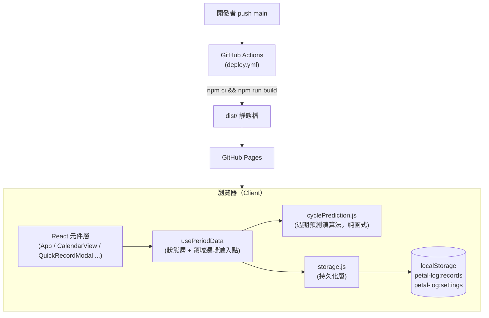
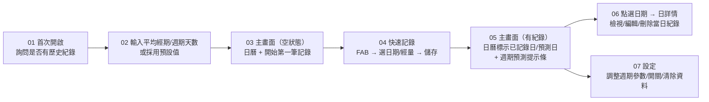

# Petal Log 軟體設計文件（Software Design Document）

| 項目 | 內容 |
|---|---|
| 專案名稱 | Petal Log |
| 文件版本 | v1.10 |
| 最後更新 | 2026-07-10 |
| 狀態 | 現行版本（對應已實作功能） |

---

## 1. 專案概述

Petal Log 是一款以隱私為優先設計的經期記錄網頁應用（Web App）。使用者可以快速記錄每日經量、在日曆上檢視歷史紀錄，並依據過去週期自動預測下一次經期的開始日與目前所在的週期天數。

**核心定位**

- **輕量、免帳號、免安裝**：開啟網頁即可使用，無需註冊。
- **資料留在本機**：所有紀錄僅存於瀏覽器 `localStorage`，不上傳任何伺服器。
- **中性化設計**：介面文案固定採用中性字眼（如「記錄」取代「經期記錄」），在他人瞥見螢幕時降低隱私暴露風險；v1.9 前曾提供可關閉的開關，但因實際影響範圍極小（僅少數按鈕文字）且中性化本來就是預設值，已簡化為固定行為，不再是使用者可調整的設定。
- **低操作成本**：從開啟 App 到完成一筆記錄，最少只需兩次點擊（FAB → 選經量 → 儲存）。

---

## 2. 目標與非目標

### 2.1 目標

1. 讓使用者在 10 秒內完成一筆經期記錄。
2. 提供「目前週期第幾天」與「預計下次日期」兩項核心預測資訊。
3. 完整支援紀錄的新增、檢視、修改、刪除（CRUD）。
4. 首次使用時透過 Onboarding 蒐集歷史週期資訊，加速預測準確度收斂。
5. 純前端、零後端依賴，可靜態託管於 GitHub Pages。

### 2.2 非目標（現階段不處理）

- 不做多使用者帳號系統與登入機制。
- 不做跨裝置資料同步（見第 14 章未來規劃）。
- 不記錄經量以外的健康資訊（症狀、心情、體溫等）。
- 不做原生 App（iOS / Android）封裝。

---

## 3. 系統架構

Petal Log 是一個純前端單頁應用（SPA），沒有後端服務。所有狀態管理與資料持久化都在瀏覽器內完成。



**架構特點**

- **單向資料流**：UI 觸發事件 → `usePeriodData` 呼叫 `storage.js` 寫入 → 更新 React state → UI 重新渲染。元件不直接操作 `localStorage`。
- **領域邏輯與 UI 解耦**：`cyclePrediction.js` 是不依賴 React、不做 I/O 的純函式模組，方便未來單獨測試或替換演算法。
- **無全域狀態管理庫**：目前規模下用單一 Hook（`usePeriodData`）搭配 `useState`/`useMemo`/`useCallback` 已足夠，避免引入 Redux/Zustand 等額外複雜度。

---

## 4. 技術棧

| 分類 | 選用 | 版本 |
|---|---|---|
| UI 框架 | React | ^18.3.1 |
| 建構工具 | Vite | ^5.4.11 |
| 日期處理 | date-fns | ^4.1.0 |
| 樣式方案 | CSS Modules（`*.module.css`） | — |
| 部署 | GitHub Actions + GitHub Pages | — |
| 資料儲存 | 瀏覽器 `localStorage` | — |

選型原則：所有依賴都刻意精簡（僅 3 個 runtime 套件），符合「輕量、免安裝、快速載入」的產品定位。

---

## 5. 目錄結構

```
Pental-Log/
├── .github/workflows/deploy.yml   # CI/CD：build 後部署到 GitHub Pages
├── figma-export/                  # 設計稿匯出的靜態 HTML（UI 流程參考稿，非執行程式碼）
├── src/
│   ├── main.jsx                   # 進入點
│   ├── App.jsx                    # 根元件，畫面組裝與路由狀態（onboarding / 主畫面）
│   ├── data/
│   │   └── storage.js             # localStorage 讀寫封裝（持久化層）
│   ├── hooks/
│   │   └── usePeriodData.js       # 資料狀態管理 + 串接領域邏輯
│   ├── utils/
│   │   ├── cyclePrediction.js     # 週期預測演算法（純函式，含異常偵測）
│   │   └── symptoms.js            # 伴隨症狀選項定義 + 症狀頻率統計
│   ├── components/
│   │   ├── OnboardingFlow/        # 首次使用引導
│   │   ├── EmptyStateOnboarding/  # 無紀錄時的空狀態
│   │   ├── CalendarView/          # 月曆檢視
│   │   ├── PredictionBanner/      # 週期天數 / 預計下次 提示條
│   │   ├── AnomalyBanner/         # 週期異常提醒條（週期不規律／經期過長）
│   │   ├── QuickRecordModal/      # FAB 快速記錄
│   │   ├── DayDetail/             # 單日詳情（檢視/編輯/刪除）
│   │   ├── FlowPicker/            # 經量選擇（量少/中/多）共用元件
│   │   ├── SymptomPicker/         # 伴隨症狀多選共用元件
│   │   ├── ReportView/            # 週期報表全畫面（摘要/歷史表/異常標記/症狀統計，可列印為 PDF）
│   │   └── SettingsPanel/         # 設定面板
│   └── styles/
│       ├── tokens.css             # 設計 token（顏色/字級/間距/圓角）
│       └── global.css             # 全域樣式
└── vite.config.js                 # CI 用 base '/Petal-Log/'＋ESM；本機用相對路徑＋IIFE，讓 dist/index.html 可雙擊開啟（見第 12 章）
```

---

## 6. 模組設計

### 6.1 `App.jsx`（根元件）

- 職責：串接 `usePeriodData`，管理畫面層級的 UI 狀態（目前月份、選取日期、Modal 開關）。
- 依據 `settings.onboardingCompleted` 決定顯示 Onboarding 或主畫面。
- 依據 `records.length === 0` 決定顯示 `EmptyStateOnboarding` 或 `PredictionBanner`。

### 6.2 `usePeriodData`（狀態層）

對外提供的介面：

| 回傳值 | 說明 |
|---|---|
| `records` | 所有紀錄陣列 |
| `recordByDate` | `Map<date, record>`，供日曆快速查找 |
| `prediction` | `cyclePrediction.js` 算出的預測結果 |
| `settings` | 使用者設定 |
| `recordDay(date, flow)` | 新增或覆寫某天紀錄，內含「自動填滿後續天數」邏輯 |
| `editRecord(id, patch)` / `removeRecord(id)` | 修改 / 刪除單筆紀錄 |
| `updateSettings(patch)` | 局部更新設定並落盤 |
| `resetAllData()` | 清空所有紀錄與設定 |

**關鍵行為 — 自動填滿後續天數**：當使用者記錄「新一次經期的第一天」（前一天沒有紀錄）且 `settings.autoFillSubsequentDays` 為真時，會依平均經期天數自動建立後續數天的紀錄，減少重複操作。

### 6.3 `storage.js`（持久化層）

以兩把 key 存取 `localStorage`：

- `petal-log:records`：紀錄陣列，寫入時依 `date` 去重並排序。
- `petal-log:settings`：使用者設定物件。

所有讀取皆有 `try/catch` 保底，JSON 解析失敗時退回預設值，避免壞資料造成白畫面。

### 6.4 `cyclePrediction.js`（領域邏輯層）

詳見第 8 章。

### 6.5 UI 元件

| 元件 | 職責 |
|---|---|
| `OnboardingFlow` | 二階段引導：詢問是否有歷史紀錄 → 輸入平均經期/週期天數，或直接採用預設值（5 天 / 28 天） |
| `EmptyStateOnboarding` | 無任何紀錄時的第一次記錄呼籲（CTA） |
| `CalendarView` | 月曆格線渲染、月份切換、標示「已記錄日」「預測日」「易孕期」「排卵日」與（選配）四階段色條、點擊進入日詳情 |
| `PredictionBanner` | 顯示「本次週期第幾天／距離下次」「預計下次日期」「易孕期區間」（含免責提示） |
| `AnomalyBanner` | 當 `prediction.hasAnomalies` 為真且 `settings.showAnomalyAlerts` 開啟時顯示，列出偵測到的異常次數，並提供「查看報表」按鈕開啟 `ReportView` |
| `QuickRecordModal` | 由主畫面 FAB 觸發，快速記錄「今天或指定日期」的經量（不含症狀，維持最少點擊） |
| `DayDetail` | 點選日曆某天後的詳情面板，可新增/編輯/刪除當天紀錄，顯示「經期第幾天」或「排卵日/易孕期」標註，並可選配顯示伴隨症狀記錄區塊 |
| `FlowPicker` | 「量少 / 量中 / 量多」三選一元件，供 `QuickRecordModal` 與 `DayDetail` 共用 |
| `SymptomPicker` | 伴隨症狀多選晶片元件，選項來源為 `src/utils/symptoms.js` 的內建症狀（已排除 `settings.hiddenSymptoms` 中的項目）再併入 `settings.customSymptoms`；晶片顏色讀 `settings.symptomColors`（覆寫）或選項的 `defaultColor`；另有「其他」晶片，開啟後顯示自由文字輸入框，寫入 `Record.symptomNote`。供 `DayDetail` 使用 |
| `ReportView` | 取代主畫面的全畫面報表頁：摘要統計、異常提醒、週期歷史表、伴隨症狀頻率統計，提供「列印／另存為 PDF」按鈕（呼叫瀏覽器原生 `window.print()`，零依賴） |
| `SettingsPanel` | 調整平均經期/週期天數、自動填滿開關、排卵預測顯示開關、週期階段顏色提示（手風琴，展開後為四階段開關＋色票）、症狀記錄開關（手風琴，展開後為「症狀項目與顏色設定」：內建症狀的顯示/隱藏開關＋色票、自訂症狀新增/刪除）、異常提醒開關、查看報表入口、清除所有資料 |

---

## 7. 資料模型

### 7.1 Record（單日紀錄）

```ts
{
  id: string          // 產生規則：`${date}-${Date.now()}` 或含 index 後綴
  date: string         // 'yyyy-MM-dd'
  flow: 'light' | 'medium' | 'heavy'
  symptoms: string[]   // 伴隨症狀代碼陣列（內建代碼見 `src/utils/symptoms.js`，或自訂症狀的 `custom-<timestamp>` id）；預設 []，自動填滿產生的後續天數不帶入首日症狀
  symptomNote: string  // 「其他」欄位使用者自行輸入的自由文字；預設 ''，同樣只有首日會帶入
}
```

### 7.2 Settings（使用者設定）

```ts
{
  avgPeriodLength: number           // 平均經期天數（預設 5）
  avgCycleLength: number            // 平均週期天數（預設 28）
  autoFillSubsequentDays: boolean   // 記錄首日時是否自動填滿後續天數（預設 true）
  onboardingCompleted: boolean      // 是否已完成引導（預設 false）
  showOvulationPrediction: boolean  // 是否顯示排卵日/易孕期預測（預設 true）
  showMenstrualPhase: boolean       // 月曆是否標示月經期顏色（預設 false）
  showFollicularPhase: boolean      // 月曆是否標示濾泡期顏色（預設 false）
  showOvulationPhase: boolean       // 月曆是否標示排卵期顏色（預設 false）
  showLutealPhase: boolean          // 月曆是否標示黃體期顏色（預設 false）
  showSymptomTracking: boolean      // `DayDetail` 是否顯示伴隨症狀記錄區塊（預設 false）
  showAnomalyAlerts: boolean        // 是否在主畫面顯示 `AnomalyBanner`（預設 true）
  phaseColors: {                    // 四階段各自的顏色（hex），可在設定中用色票調整
    menstrual: string                 // 預設 '#b5645c'
    follicular: string                // 預設 '#c98a2b'
    ovulation: string                 // 預設 '#4f9d8c'
    luteal: string                    // 預設 '#6f8fb0'
  }
  customSymptoms: { id: string, label: string }[]  // 使用者自訂的症狀項目，預設 []，id 格式為 `custom-${Date.now()}`
  symptomColors: Record<string, string>            // 症狀代碼（含內建與自訂）→ hex 顏色的覆寫表，未設定的內建症狀退回 `SYMPTOM_OPTIONS` 的 `defaultColor`
  hiddenSymptoms: string[]          // 被隱藏、不在 `SymptomPicker` 顯示的內建症狀代碼，預設 []（全部顯示）；僅適用內建症狀，自訂症狀直接刪除即可
}
```

> `storage.js` 的 `getSettings()` 讀取時會與 `DEFAULT_SETTINGS` 合併，確保舊版本存下、缺少新欄位的 settings 物件在升級後仍能取得新欄位的預設值。

### 7.3 儲存 Key

| Key | 內容 |
|---|---|
| `petal-log:records` | `Record[]`，依日期排序 |
| `petal-log:settings` | `Settings` |

> 目前沒有 schema 版本欄位；若未來調整資料結構，需在 `storage.js` 加入遷移（migration）邏輯，見第 13 章。

---

## 8. 核心演算法：週期預測

程式碼位置：`src/utils/cyclePrediction.js`

### 8.1 名詞定義

- **經期天數**：一次連續出血持續的天數。
- **週期天數**：從「這次經期第一天」到「下次經期第一天」的間隔天數。

### 8.2 演算流程

1. **`groupIntoCycles`**：將所有已排序的紀錄日期，依「相鄰日期間隔 ≤ 1 天視為同一次經期」的規則分組成多個「週期（cycle）」，每組記錄起始日、結束日、長度。
2. **`averageCycleLength`**：若歷史週期數 ≥ 2，取**最接近現在的最多 `MAX_CYCLES_FOR_AVERAGE`（6）次**週期起始日間隔的平均值；否則採用使用者設定值 `avgCycleLength`。超過 6 次的較舊紀錄不再納入計算，讓平均值更貼近近期實際狀況。
3. **`averagePeriodLength`**：取「非最新一次」歷史週期中，**最接近現在的最多 6 次**長度平均值（最新一次可能尚未結束，故排除，避免低估）；資料不足時採用設定值 `avgPeriodLength`。
4. **`nextPredictedDate`**：最近一次週期起始日 + 平均週期天數。
5. **`currentCycleDay`**：找出「今天以前（含今天）已開始」的最後一個週期，計算今天是該週期第幾天。此設計刻意排除未來日期的週期，避免使用者手動輸入未來紀錄時，「今天」找不到對應週期而顯示消失。
6. **`isPeriodActive`**：判斷「今天」是否落在最近一次連續紀錄範圍（`referenceCycle.startDate` ~ `referenceCycle.lastDate`）內，代表生理期是否仍在進行。
7. **`daysUntilNextPeriod`**：`nextPredictedDate` 與今天的天數差，可能為負值（代表已超過預計天數，週期延遲）。`PredictionBanner` 依 `isPeriodActive` 決定首個卡片顯示「本次週期第幾天」（進行中）或「距離下次還有幾天」（已結束），避免生理期結束後仍顯示令人困惑的週期天數。
8. **`predictedDates`**：以 `nextPredictedDate` 為起點，往後推 `averagePeriodLength` 天，標記為日曆上的「預測日」；若使用者關閉自動填滿且目前正處於一次經期中，會額外補上「本次週期尚未記錄但理論上應落在經期內」的天數，讓預測與實際填寫方式保持一致。

### 8.3 邊界情況

- 無任何紀錄：回傳 `hasData: false`，UI 顯示 `EmptyStateOnboarding`，不顯示 `PredictionBanner`。
- 只有一次週期紀錄：`averageCycleLength`／`averagePeriodLength` 退回使用者設定值。
- 演算法目前**不排除異常值**（例如使用者手誤造成的極端週期天數會直接拉進平均值）——已知限制，見第 13 章。

### 8.4 排卵與易孕期預測

`getCyclePrediction` 在算出 `nextPredictedDate` 後，會額外呼叫內部函式 `getFertilityPrediction(nextPredictedDate)`，以「日曆推算法」的通用假設回推：

- **排卵日（`ovulationDate`）**：假設黃體期固定為 14 天，即 `nextPredictedDate - 14 天`。
- **易孕期（`fertileWindowStart` ~ `fertileWindowEnd`）**：涵蓋精子存活時間（排卵前 5 天）與卵子存活時間（排卵後 1 天），即 `[排卵日 - 5, 排卵日 + 1]`。
- `fertileWindowDates`：易孕期區間內每一天的日期字串陣列，供 `CalendarView` 標記使用。

**已知限制**：此為標準日曆推算估計值，**非醫療診斷**，週期不規律的使用者準確度會明顯下降；短週期（如 `avgCycleLength` 接近 15 天下限）時，回推的易孕期可能與經期日重疊。UI 於 `PredictionBanner` 固定顯示免責提示文字。`showOvulationPrediction` 設定為 `false` 時，`App.jsx` 不會把 `fertileWindowDates`／`ovulationDate` 傳入 `CalendarView`／`PredictionBanner`／`DayDetail`，達成選配（opt-in／opt-out）效果。

### 8.5 週期四階段（月經期／濾泡期／排卵期／黃體期）

`getCyclePhases(cycleStartDate, averagePeriodLength, ovulationDate, nextPredictedDate)` 將**最近一次週期起始日**到**下次預計週期起始日前一天**（正好一個完整 `averageCycleLength`）依生理定義切成四段：

| 階段 | 區間 | 預設顏色（`settings.phaseColors`） |
|---|---|---|
| 月經期 `menstrualPhaseDates` | `cycleStartDate` ~ `cycleStartDate + averagePeriodLength - 1` | `menstrual` = `#b5645c` |
| 濾泡期 `follicularPhaseDates` | 月經期結束隔天 ~ 排卵日前一天 | `follicular` = `#c98a2b` |
| 排卵期 `ovulationPhaseDates` | 僅 `ovulationDate` 當天 | `ovulation` = `#4f9d8c` |
| 黃體期 `lutealPhaseDates` | 排卵日隔天 ~ 下次預計週期前一天 | `luteal` = `#6f8fb0` |

任一區間若起訖日反轉（如經期天數過長導致濾泡期被壓縮為 0 天）則回傳空陣列，`getDateRange` 內建此保護。四個階段各自對應一個 `Settings` 開關（`showMenstrualPhase` 等），預設皆為 `false`（opt-in）；`App.jsx` 只在對應開關開啟時才把日期陣列傳給 `CalendarView`，首頁 `PredictionBanner` 不顯示這四個階段的文字說明，僅在月曆日格上方以一條 3px 色條標示（`CalendarView.module.css` 的 `.phaseIndicator`，用 inline `style` 套用 `settings.phaseColors` 而非固定 CSS class），與底部既有的易孕期／排卵日圓點（見 8.4）分開，避免視覺重疊。每個階段的顏色可在 `SettingsPanel` 用 `<input type="color">` 個別調整，寫回 `settings.phaseColors[phase]`。

### 8.6 異常偵測與週期報表

`analyzeCycleHistory(cycles, averageCycleLength, hasReliableAverage)` 逐一檢視 `groupIntoCycles` 分出的每一次週期，標記兩種異常（僅為日曆推算的粗略提示，**非醫療診斷**）：

| 異常類型 | 判斷條件 |
|---|---|
| 經期過長 `isProlongedPeriod` | 該次週期的連續紀錄天數（`cycle.length`）超過 `PROLONGED_PERIOD_DAYS`（7 天） |
| 週期不規律 `isIrregularCycle` | 該次週期到下次週期的間隔天數（`cycleLength`）小於 `NORMAL_CYCLE_MIN_DAYS`（21）、大於 `NORMAL_CYCLE_MAX_DAYS`（35），**或**（在 `hasReliableAverage` 為真，即至少有 2 次週期間隔可計算平均時）與 `averageCycleLength` 相差超過 `PERSONAL_CYCLE_DEVIATION_DAYS`（7 天）。最新一次週期因尚未有下一次起始日，`cycleLength` 為 `null`，不做此項判斷 |

`getCyclePrediction` 回傳的 `cycleHistory` 陣列即為逐週期的 `{ startDate, endDate, periodLength, cycleLength, isProlongedPeriod, isIrregularCycle }`；`hasAnomalies`／`prolongedPeriodCount`／`irregularCycleCount` 為彙總結果。

- **`AnomalyBanner`**：`settings.showAnomalyAlerts`（預設 `true`）開啟且 `prediction.hasAnomalies` 為真時，於主畫面 `PredictionBanner` 下方顯示提醒文字與「查看報表」按鈕。
- **`ReportView`**：由 `SettingsPanel`「查看週期報表」或 `AnomalyBanner`「查看報表」開啟，於 `App.jsx` 以 `isReportOpen` 狀態整頁取代主畫面（同 Onboarding 的整頁切換模式），內容包含：
  1. 摘要統計：已記錄週期數、平均週期／經期天數、週期／經期天數範圍（取自 `cycleHistory` 逐項最小最大值）。
  2. 異常提醒（`hasAnomalies` 時顯示）：異常次數與門檻說明。
  3. 週期歷史表：逐次週期的起始日、結束日、經期天數、週期天數，異常列以底色與 `⚠` 標示。
  4. 伴隨症狀統計：`summarizeSymptoms(records, settings.customSymptoms)`（定義於 `src/utils/symptoms.js`）統計每個症狀代碼（含自訂）出現次數，並列出所有「其他」自由文字備註（依日期排序）。
  5. 「列印／另存為 PDF」按鈕呼叫瀏覽器原生 `window.print()`；`ReportView.module.css` 用 `@media print` 隱藏返回／列印按鈕列（`.noPrint`），不需要任何 PDF 產生套件，維持專案「零額外重依賴」原則。
  6. **列印防溢出**：`.table` 使用 `table-layout: fixed`，並在表格儲存格、統計清單、備註清單上加 `overflow-wrap: break-word` / `word-break: break-word`。原因：症狀備註是使用者自由輸入的文字，可能出現沒有空白可斷行的長字串（例如英數字混雜），若表格維持預設的 `table-layout: auto`，瀏覽器會依內容最小寬度撐開欄位，導致整張表格比列印頁面還寬而被裁切、且列印對話框的「縮放比例」對此無效（縮放是在版面配置完成後才套用，無法讓已經超寬的表格重新換行）。同時在 `@media print` 加上 `@page { margin: 12mm }` 與較小的表格字級，讓內容穩定落在紙張可印刷範圍內。
  7. **列印安全邊距**：`@page { margin: 12mm }` 並非所有瀏覽器／印表機驅動、或「列印為 PDF」的轉檔路徑都會確實套用（例如部分環境會忽略 `@page` 規則），若只靠它留白，內容可能貼齊紙張最外緣，實際列印時被裁切。因此 `.page` 在 `@media print` 下額外保留 `padding: 8mm`，把安全邊距內建在內容本身的版面配置裡，不依賴 `@page` 是否生效，雙重保險。

---

## 9. 使用者流程

對應 `figma-export/` 內的設計稿順序：



**主要互動路徑**

- **首次使用**：`01 → 02（或跳過）→ 03`。
- **日常記錄**：主畫面點 FAB →（`04`）選日期與經量 → 儲存 → 日曆即時更新。
- **補記錄/修改/刪除**：主畫面點日曆格子 →（`06`）進入 `DayDetail`。
- **調整參數**：主畫面右上角齒輪 →（`07`）`SettingsPanel`。

---

## 10. 設計系統（UI 視覺語言）

定義於 `src/styles/tokens.css`，供作品集展示參考：

- **主色 Rose**（`#b5645c` 系）：代表「已記錄的經期日」，也是四階段色條「月經期」的預設色。
- **輔色 Lavender**（`#9b8ac4` 系）：代表「預測日」，也是 `SymptomPicker`「其他」晶片與自訂症狀的預設色。
- **點綴色 Mint**（`#4f9d8c` 系）：代表「易孕期／排卵日」，也是四階段色條「排卵期」的預設色，與 Rose/Lavender 區隔以降低誤讀風險。
- **階段色 Amber**（`#c98a2b` 系）／**Slate**（`#6f8fb0` 系）：分別是四階段色條「濾泡期」與「黃體期」的預設色，僅在 `SettingsPanel` 個別開啟對應開關時才會出現在月曆上。
- **症狀色**：`src/utils/symptoms.js` 為 10 個內建症狀各指定一個 `defaultColor`（延伸自上述色系的低飽和變體）；四階段與所有症狀（含自訂）的顏色都**不是寫死的 token**，而是存在 `settings.phaseColors`／`settings.symptomColors`，可在 `SettingsPanel` 用原生 `<input type="color">` 色票逐一調整，`CalendarView`／`SymptomPicker` 皆以 inline `style` 套用實際值，token 只作為兩者的預設值來源。
- **中性色**：米白底（`#fbf6f3`）+ 深棕字（`#453936`），營造柔和、低刺激的視覺氛圍，符合健康記錄類產品的情緒基調。
- **字型**：中文用 Noto Sans TC / PingFang TC；數字（日期）用 Inter，強化日曆數字的辨識度。
- **圓角與陰影**：卡片/面板使用 `16px` 圓角與柔和陰影，Modal 皆以 bottom-sheet 形式呈現，符合行動裝置操作習慣。

---

## 11. 非功能需求

### 11.1 隱私與資料安全

- **零伺服器、零帳號**：所有資料只存在使用者自己的瀏覽器內，不會有第三方（含開發者本人）能存取。
- **中性語言（固定行為）**：介面文案固定使用中性字眼（如「記錄」），降低他人瞥見螢幕時識別出這是經期記錄 App 的風險；不再提供關閉此行為的設定。
- **風險**：`localStorage` 未加密，共用裝置上的其他使用者理論上可透過瀏覽器開發者工具讀取；目前不在威脅模型（threat model）處理範圍內。

### 11.2 效能

- Runtime 依賴僅 3 個套件，建構後 bundle 體積小，適合行動網路環境載入。
- 所有清單/日曆運算使用 `useMemo` 快取，避免不必要的重算。

### 11.3 無障礙（Accessibility）

- 已具備：`aria-label`（月份切換、設定按鈕）、`role="dialog"` + `aria-modal`（各 Modal）、`role="radiogroup"` + `aria-checked`（`FlowPicker`）。
- 尚待加強：鍵盤 focus trap（Modal 開啟時焦點未強制鎖定於面板內）、色彩對比的正式驗證（WCAG AA）。

### 11.4 瀏覽器相容性

- 依賴 `localStorage`、`<input type="date">`，需現代瀏覽器（不含 IE）。
- 目前未做 `localStorage` 不可用（無痕模式限制、容量滿）時的錯誤提示與降級處理。

---

## 12. 部署與 CI/CD

- **流程**：push 到 `main` 分支 → GitHub Actions（`.github/workflows/deploy.yml`）執行 `npm ci && npm run build` → 產出的 `dist/` 上傳為 Pages artifact → 部署到 GitHub Pages。
- **無測試關卡**：目前 CI 只做 build，沒有 lint / 單元測試步驟（見第 13 章已知限制）。
- **雙重建置模式**：`vite.config.js` 以 GitHub Actions 自動設定的 `CI` 環境變數區分兩種建置結果：
  - **CI（`CI=true`，GitHub Pages）**：`base: '/Petal-Log/'`（對應 repo 子路徑），輸出標準 ES module（`<script type="module">`），走 http(s) 協定不受檔案協定限制。
  - **本機（未設定 `CI`）**：`base: './'`（相對路徑）；`build.rollupOptions.output.format` 改為 `'iife'`，打成單一傳統 script；自訂的 `localFileOpenHtml` 外掛（`transformIndexHtml`）把輸出 HTML 的 `type="module"` 換成 `defer`、移除 `crossorigin` 屬性。這是因為用瀏覽器直接以 `file://` 開啟 `dist/index.html` 時，Chrome 會以「origin 是 null」擋掉 `type="module"` 與帶 `crossorigin` 資源的 CORS 請求，導致空白頁；改成傳統 `<script defer>` 就能繞開此限制，讓 `npm run build` 產出的 `dist/index.html` 可以直接雙擊在瀏覽器開啟，不需要跑任何伺服器或指令。兩種模式產出的功能完全一致，只有打包格式與路徑不同。

---

## 13. 已知限制

| 限制 | 說明 |
|---|---|
| 單裝置、無備份 | 資料僅存於單一瀏覽器的 `localStorage`；清除瀏覽器資料、換裝置、換瀏覽器即遺失紀錄，且無任何匯出/備份手段。 |
| 無雲端同步 | 無法跨裝置檢視/記錄。 |
| 無通知提醒 | 不會主動提醒使用者「預計經期即將到來」。 |
| 預測演算法簡化 | 直接取歷史週期算術平均，未排除異常值（如手誤造成的極端天數），週期不規律的使用者預測準確度會下降。 |
| 無自動化測試 | 目前無單元測試（尤其 `cyclePrediction.js` 這類含邊界情況的純函式，最適合補測試）與 CI lint 關卡。 |
| 無 schema 版本控管 | `storage.js` 沒有資料版本欄位，未來若調整 Record/Settings 結構，舊資料需要手動處理遷移。 |

---

## 14. 未來規劃（Roadmap）

以下項目為已知方向，尚未排定優先順序與時程，設計時需注意「純本地、零後端」是目前的核心賣點，任何雲端相關功能都應設計為**選配（opt-in）**，不影響不需要該功能的使用者。

### 14.1 雲端同步 / 帳號系統

- 需新增後端服務（或採用 BaaS，如 Supabase / Firebase）與認證機制。
- 架構上建議將 `storage.js` 抽象為介面（`LocalAdapter` / `CloudAdapter`），`usePeriodData` 不感知底層是本地還是雲端，未來才好雙寫或切換。
- 需設計本地/雲端資料衝突時的合併策略（例如以 `updatedAt` 時間戳決勝）。

### 14.2 多裝置備份

- 若不做完整帳號系統，可先做輕量版：產生備份檔（JSON）供使用者手動於新裝置匯入，作為雲端同步前的過渡方案，與 14.4 資料匯出可共用底層邏輯。

### 14.3 通知提醒

- Web 端可用 `Notification API` + Service Worker（需將專案升級為 PWA，含 manifest 與 SW 註冊）。
- 提醒時機建議可設定（如「預計經期前 N 天」），通知文案沿用第 2 章的中性語言原則（固定行為，非設定）。

### 14.4 資料匯出（CSV / JSON）

- **v1.5 已實作人類可讀的 PDF 報表**（見 8.6、`ReportView`，透過瀏覽器列印產生），滿足「提供醫師參考」的需求；但**機器可讀的原始資料匯出（CSV / JSON）仍未實作**。
- 相對低成本、可優先實作：讀取 `getRecords()` 結果，序列化為 CSV 或 JSON 並觸發瀏覽器下載（`Blob` + `<a download>`），無需新增依賴。
- 可與 14.2 的「匯入」功能對應，形成完整備份/還原迴路，是 PDF 報表無法取代的用途。

### 14.5 週期圖表統計

- 新增如「近 6 個月週期天數趨勢」「經量分佈」等圖表，呈現於 `SettingsPanel` 或新增獨立的「統計」頁籤。
- 資料來源可直接複用 `cyclePrediction.js` 的 `groupIntoCycles` 分組結果，避免重複造輪子；圖表繪製可先評估用輕量 SVG 手刻，維持目前「零額外重依賴」的原則，再視需求導入圖表庫。

---

## 15. 詞彙表

| 詞彙 | 說明 |
|---|---|
| 經期天數（Period length） | 一次連續出血持續的天數 |
| 週期天數（Cycle length） | 這次經期第一天到下次經期第一天的間隔天數 |
| Flow（經量） | `light`（量少）/ `medium`（量中）/ `heavy`（量多） |
| 中性語言（Neutral language） | 介面文案固定採用的隱私保護寫法，隱藏「經期」等敏感字眼（非使用者可調整的設定） |
| 自動填滿（Auto-fill subsequent days） | 記錄經期首日時，依平均經期天數自動建立後續天數紀錄的設定 |

---

## 修訂紀錄

| 版本 | 日期 | 說明 |
|---|---|---|
| v1.0 | 2026-07-10 | 首版，涵蓋現行架構與已知未來規劃 |
| v1.1 | 2026-07-10 | 新增排卵日／易孕期預測功能（`cyclePrediction.js` 的 `getFertilityPrediction`、`showOvulationPrediction` 設定、對應 UI 標示與免責提示） |
| v1.2 | 2026-07-10 | `PredictionBanner` 首個卡片改依 `isPeriodActive` 切換顯示內容：生理期進行中顯示「本次週期第幾天」，結束後改顯示「距離下次生理期還有幾天」 |
| v1.3 | 2026-07-10 | 1) 預設週期天數 30→28 天；2) `averageCycleLength`／`averagePeriodLength` 改為只取最近 6 次週期計算（`MAX_CYCLES_FOR_AVERAGE`）；3) 新增月經期/濾泡期/排卵期/黃體期四階段計算（`getCyclePhases`）與月曆色條標示，各階段獨立 opt-in 設定開關；4) 新增伴隨症狀記錄（`Record.symptoms`、`SymptomPicker`、`showSymptomTracking` 開關） |
| v1.4 | 2026-07-10 | 1) `SymptomPicker` 新增「其他」晶片＋自由文字輸入（`Record.symptomNote`）；2) 新增 `settings.customSymptoms`，可在 `SettingsPanel` 新增/刪除自訂症狀，與內建症狀併入同一個選單；3) 四階段顏色與症狀顏色（含自訂症狀）皆從寫死的 CSS token 改為 `settings.phaseColors`／`settings.symptomColors`，可在 `SettingsPanel` 用色票個別調整，`CalendarView`／`SymptomPicker` 改用 inline style 套用 |
| v1.5 | 2026-07-11 | 新增異常偵測與週期報表（見 8.6）：`analyzeCycleHistory` 標記「經期過長」／「週期不規律」，`AnomalyBanner` 於主畫面提醒（`showAnomalyAlerts` 開關），`ReportView` 提供摘要統計／週期歷史表／異常標記／症狀頻率統計，並可透過瀏覽器原生列印功能另存為 PDF（零額外依賴） |
| v1.6 | 2026-07-11 | 修正 `ReportView` 列印／PDF 匯出時內容超出頁面邊界的問題：1) 表格改用 `table-layout: fixed` 並加上文字換行保護，避免使用者輸入的長字串（症狀備註）撐寬表格；2) `.page` 在列印時額外保留 `padding: 8mm` 安全邊距，不完全依賴可能不被所有環境套用的 `@page margin`（見 8.6 第 6、7 點） |
| v1.7 | 2026-07-11 | `SettingsPanel` 症狀設定改為手風琴（預設收起，展開才顯示「症狀項目與顏色設定」清單），並新增 `settings.hiddenSymptoms`：可個別關閉內建症狀在 `SymptomPicker` 的顯示，不影響歷史紀錄或報表統計 |
| v1.8 | 2026-07-11 | `SettingsPanel` 的「週期階段顏色提示」比照症狀設定，同樣改為手風琴（預設收起，展開才顯示四階段開關＋色票），讓設定面板預設更精簡 |
| v1.9 | 2026-07-11 | 移除 `neutralLanguage` 設定：實際影響範圍僅 FAB／快速記錄／日詳情等少數按鈕文字，且中性化本來就是預設值，改為固定行為，不再是可關閉的開關。`SettingsPanel` 移除對應開關；`App.jsx` 的 `recordLabel` 變數移除，改用元件既有的 `'記錄'` 預設值 |
| v1.10 | 2026-07-14 | `vite.config.js` 改為依 `CI` 環境變數區分兩種建置：本機建置輸出相對路徑＋IIFE 傳統 script（並用自訂外掛移除 `type="module"`／`crossorigin`），讓 `npm run build` 產出的 `dist/index.html` 可以直接雙擊在瀏覽器開啟；CI（GitHub Pages）建置行為不變 |
